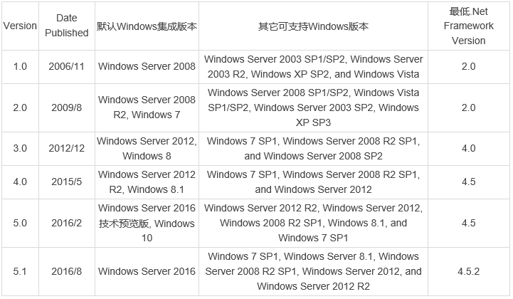
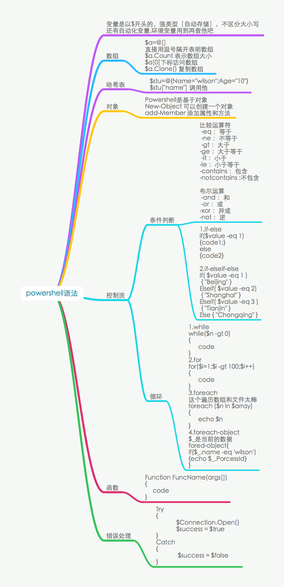

---
title: PowerShell 基础总结
date: 2018-07-05 20:08:00
categories:
   - 技术相关
tags:
   - PowerShell
   - 笔记

---

## 0x01 PowerShell简介及特性

Windows PowerShell 是一种命令行外壳程序和脚本环境(相当于 UNIX 系统 BASH),使命令行用户和脚本编写者可以利用.NET Framework的强大功能(因此也支持.NET对象)。
Windows PowerShell具备以下特性:

	操作便捷—-可识别单位(如GB、MB、KB等)Cmdlet命令结构简单(动名词形式)
	面向对象—-同面向过程相比,更容易描述现实事物
	结合.NET Framework环境—-借助.NET Framework平台的强大的库
	兼容性强—-完全兼容windows平台上其他调用,如exe文件执行、bat脚本执行等
	基于平台的可扩展性—-PowerShell俨然已形成一个平台,并且向各类平台管理提供对应管理组件

PowerShell Version 

<!-- more -->

各版本独立包下载地址如下：

	Windows PowerShell 1.0：
		https://support.microsoft.com/en-us/help/926139/windows-powershell-1.0-english-language-installation-packages-for-windows-server-2003-and-for-windows-xp。
		https://support.microsoft.com/en-us/help/928439/windows-powershell-1.0-installation-package-for-windows-vista。

	Windows PowerShell 2.0：
		https://support.microsoft.com/en-us/help/968929/windows-management-framework-windows-powershell-2.0,-winrm-2.0,-and-bits-4.0。

	Windows PowerShell 3.0：
		https://www.microsoft.com/en-us/download/details.aspx?id=34595。

	Windows PowerShell 4.0：
		https://www.microsoft.com/en-us/download/details.aspx?id=40855。

	Windows PowerShell 5.0：
		https://www.microsoft.com/en-us/download/details.aspx?id=50395。

	Windows PowerShell 5.1：
		https://www.microsoft.com/en-us/download/details.aspx?id=54616。
	
	

## 0x02 PowerShell基础语法

PowerShell基础语法

### 1) 交互式

a)	命令:cmdlet命令—动词+名词(通过get-command –commandtype cmdlet

c)	惯用帮助文档:通过Get-Help(别名:Help)-Name 命令名    help IEX

b)	别名机制:Get-Alias –name 命令名

### 2) 变量

a)	定义变量:PowerShell不需要声明变量,可自动创建变量,变量值可以是字符也可以是命令,但是变量名前必须有$

	$a=1
	$b=2
	"$a,$b" -> 1,2

	$c=$a+$b
	$d='的文'
	"$c,$d" -> 3,的文

注意:输出多个变量时需要使用双引号,单引号是不会取变量中的值的。

以下给num变量添加只读属性。

	> New-Variable xx -value "33" -Option ReadOnly
	> $xx=5
	Cannot overwrite variable xx because it is read-only or constant.

### 3) 数组

a)	创建数组:常规数组可以使用逗号,连续数字数组可以使用。

	> $xxc = 1,"434",(get-date)
	> $xxc
		1
		434
		Wednesday, July 4, 2018 3:07:06 AM
	
	其中有以下两个特例:
	空数组:
	> $strr = @()
	> $strr -is [array]
		True
	一个元素数组:
	> $strr = ,"dd"
	> $strr -is [array]
	> $strr.Count
		1
		
b)	数组的操作
	数组访问同python类似,从0开始
	数组的判断:$str –is [array]
	数组的追加:$books +=”需要添加的值”
	
	$strr +="ffff"
	$strr.Count
		2

c)	哈希表的使用
	之前创建空数组是使用@()
	而创建哈希表用到的是@{}
	此处的哈希表同python中的字典类型类似:
	
	> $hashlist = @{'ddd'=3434;'5'=66;"ewew"='dsd'}
	> $hashlist
		Name                           Value                                           
		----                           -----                                           
		5                              66                                              
		ddd                            3434                                            
		ewew                           dsd   
	
创建Hash表，语法以@{开头以}结尾，在分隔符内以定义键值对集，其中键值以=分割，不同的键值对以;分割。
例：

	$test = @{ b1 = "prml"; b2 = "ia"}

可以通过$test.b1、$test['b1']访问值，通过$test.keys得到所有键。 

PowerShell中创建数组的方式以逗号分割，例$test = 1, 2, 3，

对于数字数组还可以使用范围运算符$test = 2 .. 3。PowerShell中数组默认是多态的，

即可以在数组中存储任意类型的对象。创建单元素数组$test = ,1，创建空数组$test = @()。

### 4) 简写对比

PowerShell语句解析
双引号、单引号与反引号之间的区别。

转义序列，如下：

    `n      换行         
    `r      回车     
    `t      水平制表符
    `a      警铃
    `b      退格
    `'      单引号
    `"      双引号   
    `0      空
    ``      单反引号

PowerShell类型

	PowerShell类型别名	.NET类型
	int[]			System.Int32
	[int[]]			System.Int32[]
	[long]			System.Int64
	[long[]			System.Int64[]
	[string]		System.String
	[string[]]		System.String[]
	[char]			System.Char
	[char[]]		System.Char[]
	[bool]			System.Boolean
	[bool[]]		System.Boolean[]
	[byte]			System.Byte
	[byte[]]		System.Byte[]
	[double]		System.Double
	[double[]]		System.Double[]
	[decimal]		System.Decimal
	[decimal[]]		System.Decimal[]
	[float[]]		System.Single
	[single]		System.Single
	[regex]			System.Text.RegularExpressions.Regex
	[array]			System.Array
	[xml]			System.Xml.XmlDocument
	[sriptblock]		System.Management.Automation.ScriptBlock
	[switch]		System.Management.Automation.SwitchParameter
	[hashtable]		System.Collections.Hashtable
	[psobject]		System.Management.Automation.PSObject
	[type]			System.Type
	[type[]]		System.Type[]

访问静态方法，[类名]::属性名，如
	
	[math]::cos([math]::pi / 3)
	
类型转换，例：

	[string] [char[]] ( [int[]] [char[]] $s | foreach {$_+1} )

2>	dir nosuchfile.txt 2> err.txt	重定向错误流到文件…
2>>	dir nosuchfile.txt 2>> err.txt	重定向错误流到文件…
2>&1	dir nosuchfile.txt 2>&1	将错误流写到输出管线

非常重要的文件系统命令概览

	别名				描述									命令
	cp, cpi			复制文件或者目录							Copy-Item
	Dir, ls, gci	列出目录的内容							Get-Childitem
	type, cat, gc	基于文本行来读取内容						Get-Content
	gi				获取指定的文件或者目录					Get-Item
	gp				获取文件或目录的属性						Get-ItemProperty
	ii				使用对应的默认windows程序运行文件或者目录	Invoke-Item
	—				连接两个路径为一个路径					Join-Path
	mi, mv, move	移动文件或者目录							Move-Item
	ni				创建新文件或者目录						New-Item
	ri, rm, rmdir,del, erase, rd	删除空目录或者文件		Remove-Item
	rni, ren		重命名文件或者路径						Rename-Item
	rvpa			处理相对路径或者包含通配符的路径			Resolve-Path
	sp				设置文件或路径的属性						Set-ItemProperty
	Cd,chdir, sl	更改当前目录的位置						Set-Location
	—				提取路径的特定部分,例如父目录,文件名		Split-Path
	—				测试指定的路径是否存在					Test-Path
	gsv				获取系统服务						get-service
	ps, gps				获取系统进程						get-process

用于指定相对路径的四个重要的特殊字符

	字符	意义		示例	示例描述
	.	当前目录	ii .	用资源浏览器打开当前目录
	..	父目录		Cd ..	切换到父目录
	\	驱动器根目录	Cd \	切换到驱动器的顶级根目录
	~	家目录		Cd ~	切换到PowerShell初始化的目录

存储在环境变量中的Windows特殊目录

	特殊目录							描述							示例
	C:\Users\YvY\AppData\Local		存储在本地机器上的应用程序数据	$env:localappdata
	C:\Users\YvY					用户目录							$env:userprofile
	C:\Program Files\Common Files	应用程序公有数据目录				$env:commonprogramfiles
	C:\Users\Public					所有本地用户的公有目录			$env:public
	C:\Program Files				具体应用程序安装的目录			$env:programfiles
	C:\Users\YvY\AppData\Roaming	漫游用户的应用程序数据			$env:appdata
	C:\Users\YvY\AppData\Local\Temp	当前用户的临时目录				$env:tmp
	C:\Users\YvY\AppData\Local\Temp	公有临时文件目录					$env:temp
	C:\Windows						Windows系统安装的目录			$env:windir

构造路径的方法

	方法					描述								示例
	ChangeExtension()		更改文件的扩展名						ChangeExtension(“test.txt”, “ps1”)
	Combine()				拼接路径字符串; 对应Join-Path		Combine(“C:\test”, “test.txt”)
	GetDirectoryName()		返回目录对象:对应Split-Path -parent	GetDirectoryName(“c:\test\file.txt”)
	GetExtension()			返回文件扩展名						GetExtension(“c:\test\file.txt”)
	GetFileName()			返回文件名:对应Split-Path -leaf		GetFileName(“c:\test\file.txt”)
	GetFileNameWithoutExtension()	返回不带扩展名的文件名		GetFileNameWithoutExtension(“c:\test\file.txt”)
	GetFullPath()			返回绝对路径							GetFullPath(“.\test.txt”)
	GetInvalidFileNameChars()	返回所有不允许出现在文件名中字符	GetInvalidFileNameChars()
	GetInvalidPathChars()	返回所有不允许出现在路径中的字符		GetInvalidPathChars()
	GetPathRoot()			返回根目录:对应Split-Path -qualifier	GetPathRoot(“c:\test\file.txt”)
	GetRandomFileName()		返回一个随机的文件名					GetRandomFileName()
	GetTempFileName()		在临时目录中返回一个临时文件名		GetTempFileName()
	GetTempPath()			返回临时文件目录						GetTempPath()
	HasExtension()			如果路径中包含了扩展名,则返回True		HasExtension(“c:\test\file.txt”)
	IsPathRooted()			如果是绝对路径,返回为True; Split-Path -isAbsolute	IsPathRooted(“c:\test\file.txt”)

运行命令中包含空格的命令,需要用单引号将命令括起来,同时在命令前面加: & 符号; 
这在PowerShell中称为调用操作
Exp:

	&'C:\Program Files\Program\Program.exe' arguments
	
	

### 4) PowerShell的安全执行策略
	默认情况下,PowerShell不允许执行脚本文件,上面的用户配置文件也包括在内;如果不修改PowerShell的安全执行策略,
	你在PowerShell执行Get-ExecutionPolicy命令来查看默认的策略组
	
	Set-ExecutionPolicy RemoteSigned
	PS C:\>> Import-Module .\nishang-master\nishang.psm1
	nishang.psm1 cannot be loaded. The filem is not digitally signed. You cannot run this script on thecurrent system.
	.....
	Set-ExecutionPolicy -Scope Process -ExecutionPolicy Bypass

	ok

### 5) PowerShell 中内置的命令

实现cmd中tasklist的功能。

PowerShell中内置的命令称为cmdlets,cmdlet实现具有以下特点:

　　1)统一的命令形式
　　2)支持管道功能
　　3)输出易于管理的对象,支持面向对象的概念

在PowerShell中有一个内置的变量: $profile;这个变量指示了PowerShell用户自定义配置文件。
可以在PowerShell中输入 $profile。

cd命令现在用set-location命令替代了;dir命令用get-childitem命令替代了。
通过:   set-alias 命令来设置命令别名。

	set-alias   new     new-objector
	set-alias   iexplorer  'c:\program files\internet explorer\iexplorer.exe'

获取指定命令的帮助信息

　　eg:  get-command  get-process

利用通配符进行搜索
PowerShell支持通配符搜索,这一功能的完美支持,完全可以媲美linux下的正则表达式。

	get-command *char*

例如搜索带动词get的命令:  

	get-command   -verb   get
	
搜索带名词service的命令:  

	get-command   -noun  service

cmdlets一致的命令接口模式

　　PowerShell采用一种称为cmdlets的命令接口模式,所有的命令都遵循这样的命令模式:
动词-名词,如:get-command 命令, get就是动词,而command就是名词

	get-process  / get-eventlog    

在PowerShell中则有四种方法获取帮助:

	a)利用 get-command 命令
	b)利用 get-help  命令
	c)利用  -?命令选项
	d)查看系统帮助信息
	  
利用get-command命令和利用get-help命令获取命令帮助信息是不同的

	get-command直接从cmdlet、函数、变量脚本或者别名中获取信息,
	get-help命令则从系统帮助主题文件中获取信息,
	通常get-help命令获取的帮助信息比get-command命令详细。

Exp: 利用get-command  获取get-help帮助信息

	Get-Command Get-Help | Format-List

Exp: 利用get-help 获取自身的帮助信息

	get-help   get-help
	
利用get-help命令获取帮助信息可以指定命令选项来获取不同详细程度的帮组信息:

    a) -detailed 选项 ; 获取特定命令的帮助信息详情;例如:  get-help  -detailed   get-process
    b) -full 选项; 获取特定命令的全部帮助信息; 例如:  get-help  -full   set-location
    c) -examples 选项;获取特定命令的实例帮助信息; 例如: get-help  -examples   get-childitem

	
	
为了兼容Unix/Linux Shell(主要是bash)的命令;PowerShell中提供了一套机制来兼容cmd.exe和bash命令。

	dir cat ps ....
	
标准命令的别名,PowerShell还提供一套机制来支持内置cmdlet的命令别名。
我们知道cmdlets采用一致的用户接口模式: 动词-名词。 
例如:

	动词　　命令的缩写/别名
	get 　　g
	set　　　s
	item　　i
	location　　l
	command    cm
	
查找别名 

	Get-Alias –name f*
	
PS中还存在很多内置的别名,这个可以通过get-alias cmdlet来查看

介绍一个重要的概念:别名驱动器,在PS中有一个内置的环境支持对象,那就是别名驱动器;其盘符为alias:; 注意这个盘符是个虚拟的逻辑对象盘符,
而不是实际的分区盘符。在PS中通过cd  alias:可以进入这个虚拟盘符。

以通过get-childitem(ls / dir )命令获取这个虚拟驱动器下的内容.

创建别名
Exp:

	set-alias	np　　c:\windows\notepad.exe     (在不同的系统上这个路径可能不同)
	
Exp:

	remove-item	alias:\np

使用函数替代带有参数的命令
使用set-alias命令不可以为带有参数的命令创建别名。
Exp:

　　function    np-Profile   {notepad   $profile}
　　这样定义的函数与别名具有类似的功能,在PS中键入np-profile 就会打开profile来编辑。

在PS中利用env环境变量对象来获取path路径。

	$env:path
	
如果要将某个路径添加到默认搜索路径下,只需像下面这样就可以:
Exp:

　　$env:path += ";H:\"

需要注意的是,这样添加的路径仅在当前会话中有效,当前会话推出后就不再有效。如果需要一直有效,就必须修改配置文件。

管理错误

	在使用PS的过程中,经常会碰到错误;在PS中又两类错误: 终止错误、 非终止错误。
	终止错误:终止错误出现时,将终止命令的执行;例如,无法删除文件,这时PS会继续运行而不管该错误,然后显示错误和输出。
	非终止错误:不终止命令的执行;例如,提交无效的操作对象,PS就会生成终止错误

PS提供的最具有突破性的功能就是:虚拟驱动器导航功能。在PS中,除了可以在文件系统驱动器之外进行浏览;还可以在HKEY_LOCAL_MACHINE(HKLM:)和
HKEY_CURRENT_USER(HKCU:)注册表配置单元驱动器中进行浏览,还可以在数字签名证书存储区(Cert:)以及当前会话中的函数等的驱动器中进行浏览,这些驱动
器统称为windows PS 驱动器。
可以通过:get-psdrive 来查看PS支持的驱动单元

文件系统中导航/浏览

Exp:

	get-item  *  可以用来获取当前目录下的内容; 而单独的get-item运行时会提示输入路径或者操作对象。
	
在PS中内置的变量 

	$home 表示当前登录者的家目录
	$pshome 则表示widnows PowerShell的安装目录
	与其他shell一样,可以再PS中进行目录和文件操作;
	这通过下面的相关cmdlet实现: get-item、get-childitem、new-item、remove-item、set-item、move-item和copy-item实现。

浏览注册表

	PS中最值得推荐的特性之一就是可以再注册表中进行浏览和方便的操作。
	并且浏览方法和文件浏览方法保持一致。在PS中HKEY_LOCAL_MACHINE配置单元
	
映射到hklm:驱动器; 而HKEY_CURRENT_USER配置单元则映射到HKCU:驱动器

	cd hkcu:
	dir hkcu\software

	
配置文件

　　PS环境默认有4个配置文件

1  针对所有用户,影响所有shell的配置文件

	这个配置文件存放在:   %windir%\system32\windowsPowerShell\v1.0\profile.psl
	修改这个配置文件将影响所有的用户,以及所有的shell。

2  针对所有用户,只影响Windows PowerShell的配置文件

	这个配置文件保存在:  %windir%\system32\windowsPowerShell\v1.0\microsoft.PowerShell_pfrofile.psl
	修改这个配置文件将影响所有的用户,但只针对windows PowerShell有效。
	
3  针对当前用户,影响所有shell的用户配置文件

	这个配置文件保存在: %userprofile%\my documents\windowsPowerShell\v1.0\profile.psl
	修改这个配置文件只对当前用户有效,但是会影响所有的shell

4  针对当前用户,只影响PS的用户配置文件

	这个配置文件保存在: %userprofile%\my documents\windowsPowerShell\v1.0\microsoft.poweshel_profile.psl
	修改这个配置文件只对当前用户有效,并且只影响PS。
	
$path 变量存储的路径
这么多配置文件,那么在当前会话中到底哪个起作用呢？
这个问题的答案就是: 只有与$path 变量中存储路径相同的配置文件才起作用; 包括路径和文件名。

### 6) 管道和对象成员
1  管道
	管道的最大特点就是:  前一个命令的输出作为后一个命令的输入。cmd、bash均支持管道

管道的概念。
在PS中,继承了cmd管道符号的表示方法:  |   表管道;

但是PS与cmd的管道有本质的区别, cmd中的管道传递的是文本信息,

而PS中传递的是对象,因此PS中的管道更加易于使用和管理。

	例如:   get-location cmdlet
	
命令返回的是一个pathinfo对象,这个对象是一个信息包,信息包中包含了相关的信息。

对象成员
利用get-member获取对象的成员信息

	get-location | get-member
	get-help  -parameter *  get-member
	
可以发现get-member cmdlet支持:force、inputobject、membertype、name、static、view这些参数。 下面我们简要的利用一下这些参数

Exp: 获取对象的静态方法和属性 

	get-location | get-member  -static
	
Exp: 获取对象的属性	

	get-location | get-member  -membertype  property

格式化输出

PS支持4个格式化cmdlet:  format-wide、 format-list、format-table、format-custom; 这里仅介绍前面三个。
	
四个命令均需要管道输出对象作为输入;四个cmdlet均有默认的输出属性,如果不进行指定,则输出默认的属性。
	
1.format-wide　　
格式化命令默认输出不同数量的属性,format-wide默认仅输出一个默认属性。

	get-command  | format-wide
	Exp: 利用format-wide 的property参数输出comandtype信息。
	get-command  | format-wide -property  commandtype
	
2.format-list
format-list以列表的形式输出信息

	get-location | format-list -property  path
	get-location | format-list -property *
	
3.format-table
format-table以表格的形式输出信息

	get-process | format-table
	利用property参数控制输出的属性
	Exp:
		get-process | format-table  -property  path,cpu,id,pm
		get-process | format-table  -property  path,cpu,id,pm   -autosize
		get-process | format-table  -property  cpu,id,pm,path   -wrap	wrap参数用来将输出信息换行输出。
		
	groupby参数
	format-table 通过groupby参数还支持分组输出

	
在PS中通过 > 来实现输出重定向

利用 >> 追加信息	get-process >> process.txt

PS新增的特性 out-* cmdlet集重定向
	PS中的out重定向命令集,具有两个特点:
	
        1 这些out-* cmdlets 的输出不是对象,而是文本格式的数据,这是因为out-* cmdlet要将数据传输到接受文本信息的系统组件
        2 这些out-* cmdlet 将数据从PS中发送到其他位置,同时在这些命令执行完毕的时候,会将在管道中传输的对象删除
		
利用Format-wide 命令来验证out-* cmdlet的第二个特性

	get-childitem | out-host  |format-wide -column 2
	
原本我们通过get-childitem命令获取当前目录下的子目录传递给out-host,

然后想利用format-wide -column 命令输出2列name属性信息,结果输出了很多列。

out-host命令将在管道中传输的对象删除了。其实质就是当out-* cmdlet执行时,将删除传递给他的对象。

变换一下管道传递的先后顺序则会得到:

	get-childitem |format-wide -column 2  | out-host  
	
注意: 所有的out命令均具有第二个特性,需要注意。

Ps中分页输出

	执行某些命令的时候,其输出信息量大,无法在当前页面中完整的显示所有信息,这就需要分页显示;
	在cmd中又more命令,在bash中也有类似的命令。
	在PS中通过参数来实现这一功能:  -paging

放弃输出

在cmd利用重定向可以阻止输出信息, 例如: dir>nul
而在PS中需要进行管道传递,并且使用专门的cmdlet: out-null。

打印输出

利用 out-printer 命令打印输出信息。

重定向输出到文件

	get-process | out-file process.txt 
	
有一点需要注意: out-file命令创建的是Unicode编码的文件,有时候为了输出ASCII编码的文件,

我们需要增加-encoding参数, 从而控制输出的文本编码格式

Exp:利用encoding参数控制编码格式

	get-process | out-file  -encoding ascii -filepath .\process.txt
	
目录和文件的建立、复制、移动和删除

item作为cmdlet名词部分的cmdlet都与文件或目录的操作有关。

利用get-command的发现功能查询文件操作相关命令

	get-command *-item
	
利用get-item获取当前用户home目录的信息

	get-item $home
	get-childitem 
	get-childitem -name
	get-childitem -path $home
	get-childitem -force	Exp: 获取所有的子项,利用force参数 
	get-childitem -path $home -recurse	Exp:递归获取路径下的子项
	new-item
		new-item -path $home\vol.txt  -itemtype file( or directory) 
	rename-item  vol.txt  volcanol.txt
	move-item   ..\volcanol.txt  .\
	copy-item vol .\desktop
	copy-item vol  .\desktop  -recurse	exp:复制容器下的项目
	remove-item  .\Desktop\vol -recurse

### 7) WMI对象和COM组件
利用Get-WmiObject命令获取WMI信息

	get-wmiobject  -list
	
输出的头部:NameSpace: ROOT\CIMV2 ; 这个输出表示当前获取的WMI类型从属于root\cimv2 命名空间

	get-wmiobject   -list  -namespace   root\cimv2
	
get-wmiobject有很多的参数,其中一个就是:computername参数,指定计算机名或者IP地址,可以从远程计算机上获取相关的信息:

	get-wmiobject  -list  -computername localhost

显示WMI类的详细信息

用-class参数显示 win32_operatingsystem类的信息

	get-wmiobject  -class  win32_operatingsystem -namespace root\cimv2  
	
cmdlet均有自己默认的属性,当没有指定参数或者属性时,cmdlet将以默认的属性或者参数进行操作,

get-wmiobject也有几个默认的参数: -class;

默认的namespace是root\cimv2; 而computername默认的是本机(localhost)。

	因此上面的命令:  get-wmiobject -class win32_operatingsystem -namespace root\cimv2    
	相当于:  get-wmiobject  win32_operatingsystem 
	
利用Format命令显示非默认属性

	前面说过可以利用Format命令显示对象的非默认显示属性或者信息,这里一样可以显示非默认的信息。
	例如利用Format-table命令显示win32_operatingsystem的Total*和Free的
	get-wmiobject  -class  win32_operatingsystem -namespace root\cimv2   | format-table -property total*,free*
	
创建WMI对象
既然WMI模型中有那么多的类,那么根据面向对象的思想,我们就可以利用这些类实例化一些对象。在PS中利用New-Object命令实例化对象。

在Windows下某些软件组件具有Net Framework和Com接口,因此可以执行许多的系统的管理任务;

PS可以使用这些组件。早起版本的Ps多数的cmdlet不支持远程计算机。

但在PS中利用Net Framework的system.diagnostics.eventlog类管理事件日志时可消除这个限制。

new-object命令创建system.diagnostics.eventlog对象

	new-object -typename  system.diagnostics.eventlog    

如上所示,我们创建了一个system.diagnostics.eventlog的对象,但是这个对象实例没有包含任何的数据,这是因为没有为其指定特定的事件日志。

构造函数
与面向对象一致,需要利用类的构造函数来初始化对象。在这里我们通过指定日志名称引用特定的事件日志,

并将日志名称传递给类的构造函数。使用-argumentlist参数指定特定的事件日志

	new-object -typename system.diagnostics.eventlog  -argumentlist application    

由于在PS中大多数的Net Framework核心类在system明明空间中定义,因此如果PS找不到指定的类型名称项,

则会到system命名空间中查找类,这就是说我们可以不指定system

命名空间来引用system.diagnostics.eventlog,而是使用diagnostics.eventlog.

	new-object -typename diagnostics.eventlog  -argumentlist application
	

### 8) 静态对象
	在PS中有一类特殊的对象,我们不能同过这些类创建新的对象,这些类是不能更改状态的方法和属性的引用库。
	
	无法创建这些类,仅可以使用它。因为不能创建、销毁或更改这些类和方法,因此也将这些类叫做静态类。
	
1 system.environment 静态类

在PS中经常用到的静态类有system.environmet类。例如我们可以在PS中查看这些类:

	system.environment
	
查看了system.environment,类的信息,可以看出来system.environment,继承于system.object类。 

这里还有一点需要注意的,那就是引用静态类的时候,要用"[]",表示引用的是静态类。

2 利用get-member函数是static参数获取静态类成员

	[system.environment] | get-member
	
通过get-member获取的类型是:system.runtimetype;与原来的类型不一致,这是为什么呢?

因为静态类与其他的类在行为和方式上不同。在使用get-member命令获取静态类的信息的时候,需要附加-static参数。

可以通过指定membertype参数来分类获取静态类的属性和方法。

命令分别为:

	[system.environment] | get-member  -membertype  property     # 获取属性
	[system.environment] | get-member  -membertype  method       # 获取方法

试一下是否可以用new-object创建静态对象。

	new-object   system.environment
	
New-Object : 找不到构造函数。无法找到适合类型 system.environment 的构造函数。

可以发现,静态类没有构造函数,因此静态函数仅仅是一个库,可以使用的库,不能通过它来派生新的的类和构造类的对象。

3  引用静态类的成员
	在PS中通过全局引用符 " :: "来引用静态类的成员。
	
	[system.environment]::commandline
	-->
		"C:\Windows\system32\WindowsPowerShell\v1.0\PowerShell_ISE.exe"

利用commandline获取了PS的安装路径。还可以通过OsVersion属性获取系统的版本信息

	[system.environment]::osversion
	
4 system.math 类进行数学运算    
    在PS中还提供了另外一个静态类, system.math. 同样可以通过get-member命令获取system的成员。

	[system.math] | get-member -static  -membertype method
	
管道对象管理

执行cmdlet时,在管道中传递的对象比我们实际需要的要多,而且有时候我们并不需要关注这么多的对象,

那么我们是否可以对这些对象进行一下筛选呢？

在PS中我们可以使用where-object命令进行筛选。

1 where-object命令
利用where-object命令可以逐一的测试管道中传递的对象,并将符合筛选条件的对象在管道中进行传递,而将不符合条件的对象从管道中删除;

实现这一功能需要使用where-object的FilterScript表达式特性。
	
FiltrScript表达式为返回值为true或者false的脚本块; 脚本块是有{} 括起来的一个或者多个PS命令,这些脚本简单而功能强大。
	
使用这些脚本需要使用PS提供的另外一个特性:比较运算符。

在PS中,比较运算符不区分大小写,因为在PS中 小于(<)、大于(>) 、等于(=)因为有特殊的用途,因此用字母token表示。基本的运算符有:

	比较运算符          含义         实例(返回TRUE)
	-eq              等于             1 –eq  1
	-ne              不等于           1 –ne   2
	-lt              小于              1 –lt   2
	-le              小于或等于      1 –le    2
	-gt              大于              2 –gt  1
	-ge              大于等于        2 –ge   1
	-like            类似需要用     "file.doc"  -like    "f*.do?"
					 文本通配符
	-notlike        不类似           "file.doc"  -notlike  "p*.doc"
	-contains       包含              1,2,3  -contains   1
	-notcontains    不包含            1,2,3  -notcontains   4
	 
在PS中为了遍历管道中的对象,提供了一个预置的变量: $_  ;通过这个对象可以遍历管道中传递的对象。

利用FilterScript进行筛选

	1,2,3,4,5 | where-object  -filterscript {$_  -lt  3}
	输出 1  2

还可以根据对象的属性进行筛选。例如我们要查看WMI中win32_systemdriver类,在系统中可能有几百个这样的系统驱动程序,而我们可能

只对其中的一部分感兴趣,这样我们就可以通过FilterScript来获取我们感兴趣的驱动类。

利用FilterScript表达式获取win32_systemdriver中正在运行的类

	get-wmiobject -class  win32_systemdriver  | where-object  -filterscript {$_.state -eq "running"}
	 
PS中的逻辑运算符有:   -and、 -or、-not 、!; 分别是与、或、非(其中 ! 也是表示非)。
	 

 

## 0x03 PowerShell官方视频教程

### 1. Getting Started with Microsoft PowerShell 
	(PowerShell 3.0 入门教程 )
	
	https://www.pstips.net/powershell-v3-basic
	--> 
	https://mva.microsoft.com/en-US/training-courses/getting-started-with-microsoft-powershell-8276?l=r54IrOWy_2304984382
	简介
	课程安排
	课程 1 : 克服对 Shell 的恐惧
	课程 2 : 帮助系统
	课程 3 : 使用管道建立连接和扩展 Shell
	课程 4 : 用于管理的对象
	课程 5 : 深入探讨管道
	课程 6 : 在 Shell 中使用 PowerSehll远程管理
	课程 7 : 为自动化做好准备
	课程 8 : 大规模自动化 ：远程操作
	课程 9 : 脚本和工具制作简介

### 2. Advanced Tools & Scripting with PowerShell 3.0 Jump Start  
	( 快速入门 : PowerShell 3.0 高级工具和脚本 )
	
	https://mva.microsoft.com/en-US/training-courses/advanced-tools-scripting-with-powershell-30-jump-start-8277?l=WOWaGUWy_8604984382
	https://mva.microsoft.com/zh-cn/training-courses/advanced-tools-scripting-with-powershell-30-jump-start-8277?l=g5FhezP5_704984382
	英文源有下载
	
	背景
	教程介绍
	教程主题
	1. 脚本入门
	2. PowerShell脚本语言
	3. 简单脚本和功能
	4. 高级功能
	5. 有关参数的更多信息
	6. 编写帮助
	7. 错误处理
	8. 更改工具
	9. 脚本和清单模块
	
	
### 3. Using PowerShell for Active Directory 

	https://mva.microsoft.com/en-US/training-courses/using-powershell-for-active-directory-8397?l=zSaBLJJz_1304984382

## 0x04 Reference

	http://www.cnblogs.com/volcanol/archive/2012/05/14/2500665.html
	https://www.pstips.net/
	<< PowerShell 实战指南(第二版) >>
	 
