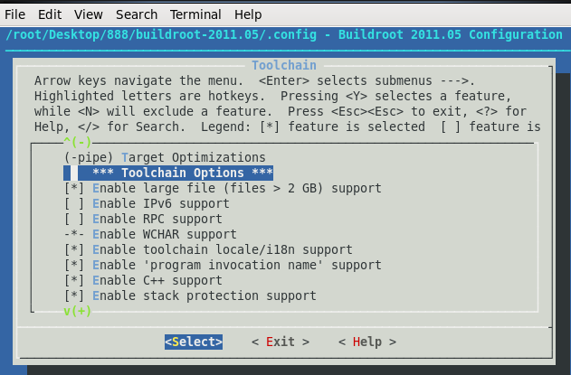
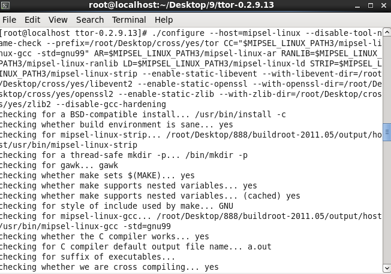
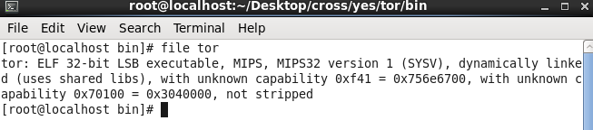
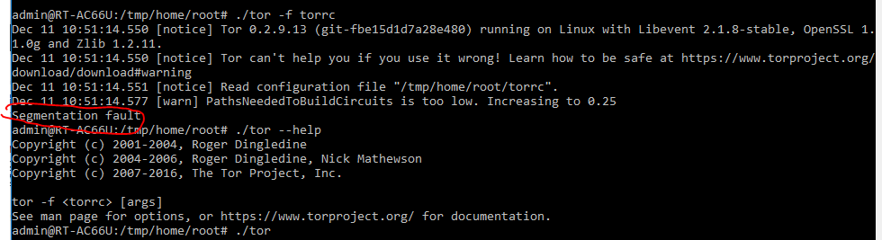
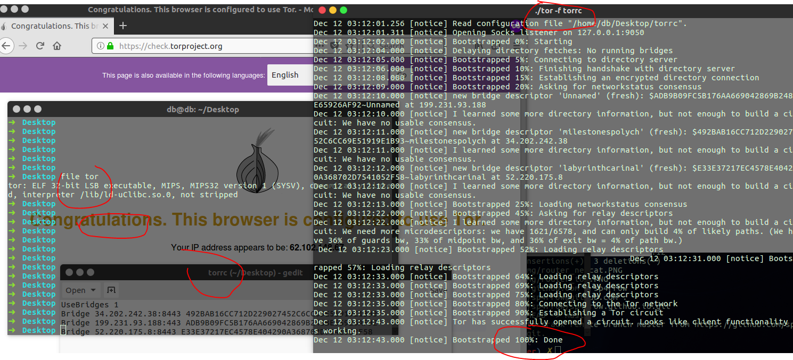

<!-- more -->
Router Model : RT-AC66U
Router CPU : MIPS32


## 正常编译tor 
在 `Ubuntu` 下

```
sudo apt-get install openssl
sudo apt-get install libevent-dev
sudo apt-get install build-essential
sudo apt-get install libssl-dev
tar xzf tor-0.3.1.8.tar.gz
cd tor-0.3.1.8
./configure && make
src/or/tor
src/config/torrc   # torrc 
src/or/tor -f src/config/torrc &
```

直接交叉编译tor 是有问题的
结合上篇文章编译buildroot生成的buildroot-2011.05下/output/ 相关编译文件:
```
$ cd tor 
$ ./configure : 
$ CC=/root/Desktop/8/buildroot-2011.05/output/host/usr/bin/mipsel-linux-gcc RANLIB=/root/Desktop/8/buildroot-2011.05/output/host/usr/bin/mipsel-linux-ranlib AR=/root/Desktop/8/buildroot-2011.05/output/host/usr/bin/mipsel-linux-ar LD=/root/Desktop/8/buildroot-2011.05/output/host/usr/bin/mipsel-linux-ld STRIP=/root/Desktop/8/buildroot-2011.05/output/host/usr/bin/mipsel-linux-strip ./configure --host=mipsel-linux --disable-tool-name-check --enable-static-libevent --with-libevent-dir=/usr/local/lib
```
<!-- more -->
即:
```
$ CC=/root/Desktop/8/buildroot-2011.05/output/host/usr/bin/mipsel-linux-gcc \
RANLIB=/root/Desktop/8/buildroot-2011.05/output/host/usr/bin/mipsel-linux-ranlib \
AR=/root/Desktop/8/buildroot-2011.05/output/host/usr/bin/mipsel-linux-ar \
LD=/root/Desktop/8/buildroot-2011.05/output/host/usr/bin/mipsel-linux-ld \
STRIP=/root/Desktop/8/buildroot-2011.05/output/host/usr/bin/mipsel-linux-strip \
./configure --host=mipsel-linux --disable-tool-name-check \
--enable-static-libevent \
--with-libevent-dir=/usr/local/lib
or 
--with-libevent-dir=/usr/lib64/
```
出错
```
checking for libevent directory... configure: WARNING: Could not find a linkable libevent.
If you have it installed somewhere unusual, you can specify an explicit path using --with-libevent-dir
configure: WARNING: On most Redhat-based systems, you can get libevent by installing the libevent RPM package
configure: WARNING:    You will probably need to install libevent-devel too.
configure: error: Missing libraries; unable to proceed.
```
装了libevent-devel 依旧如是

拷贝 bin/ 下的`mipsel-linux-*` 到 `ubuntu`
```
$ CC=/home/db/Desktop/usr/bin/mipsel-linux-gcc RANLIB=/home/db/Desktop/usr/bin/mipsel-linux-ranlib AR=/home/db/Desktop/usr/bin/mipsel-linux-ar LD=/home/db/Desktop/usr/bin/mipsel-linux-ld STRIP=/home/db/Desktop/usr/bin/mipsel-linux-strip ./configure --host=mipsel-linux --disable-tool-name-check --enable-static-libevent --with-libevent-dir=/home/db/Desktop/libevent-1.4.12-stable/
```
即:
```
$ CC=/home/db/Desktop/usr/bin/mipsel-linux-gcc \
RANLIB=/home/db/Desktop/usr/bin/mipsel-linux-ranlib \
AR=/home/db/Desktop/usr/bin/mipsel-linux-ar \
LD=/home/db/Desktop/usr/bin/mipsel-linux-ld \
STRIP=/home/db/Desktop/usr/bin/mipsel-linux-strip \
./configure --host=mipsel-linux \
--disable-tool-name-check --enable-static-libevent \
--with-libevent-dir=/home/db/Desktop/libevent-1.4.12-stable/
or 
--with-libevent-dir=/usr/lib/x86_64-linux-gnu/
--with-libevent-dir=/lib/x86_64-linux-gnu/
```
也是不行滴
 
ubuntu 直接编译 tor 后 拷贝`tor(10M)` 到 `centos`上使用,转移各种库依旧是不行滴。 

```
$./tor: error while loading shared libraries: libssl.so.1.0.0: cannot open shared object file: No such file or directory
===> 
$ copy /lib/x86_64-linux-gnu/libssl.so.1.0.0 		(ubuntu)  => desktop (centos )
$ copy /lib/x86_64-linux-gnu/libcrypto.so.1.0.0 	(ubuntu)  => desktop (centos )
$ mv libssl.so.1.0.0 /usr/lib64/			(centos )
$ mv libcrypto.so.1.0.0 /usr/lib64/		(centos )

```

$ ./tor --help
```
./tor: /lib64/libc.so.6: version 'GLIBC_2.14' not found (required by ./tor)
./tor: /lib64/libc.so.6: version 'GLIBC_2.17' not found (required by ./tor)
./tor: /lib64/libc.so.6: version 'GLIBC_2.14' not found (required by /usr/lib64/libssl.so.1.0.0)
./tor: /lib64/libc.so.6: version 'GLIBC_2.14' not found (required by /usr/lib64/libcrypto.so.1.0.0)
$ ls -al /lib/x86_64-linux-gnu/libc.so.6 	(ubuntu)
	lrwxrwxrwx 1 root root 12 Jun 16 16:57 /lib/x86_64-linux-gnu/libc.so.6 -> libc-2.23.so
$ copy /lib/x86_64-linux-gnu/libc-2.23.so		(ubuntu)  => desktop (centos )
$ mv libc-2.23.so /lib64/libc-2.23.so 		(centos )
	ln: creating symbolic link '/lib64/libc.so.6': File exists
$ mv /lib64/libc.so.6 /lib64/libc.so.6-copy
$ ln -s /lib64/libc-2.23.so /lib64/libc.so.6
error error !!!!!!!!!!!!!!!!!!!!!!!!!!!!!
$ ls -al #命令都使用不了了
ls: error while loading shared libraries: libc.so.6: cannot open shared object file: No such file or directory
$ mv
mv: error while loading shared libraries: libc.so.6: cannot open shared object file: No such file or directory

```

看了网上,tor交叉编译时需要的库,也需要交叉编译的 : 

Centos
/root/Desktop/1/ : 
```
openssl-1.1.0g
https://www.openssl.org/source/openssl-1.1.0g.tar.gz

libevent-2.1.8-stable.tar.gz
https://github.com/libevent/libevent/releases/download/release-2.1.8-stable/libevent-2.1.8-stable.tar.gz

zlib-1.2.11
https://zlib.net/zlib-1.2.11.tar.gz
```


`----------------------------------------------------------------------`


## 交叉编译 openssl 
```
$ CC=/root/Desktop/8/buildroot-2011.05/output/host/usr/bin/mipsel-linux-gcc AR=/root/Desktop/8/buildroot-2011.05/output/host/usr/bin/mipsel-linux-ar RANLIB=/root/Desktop/8/buildroot-2011.05/output/host/usr/bin/mipsel-linux-ranlib LD=/root/Desktop/8/buildroot-2011.05/output/host/usr/bin/mipsel-linux-ld STRIP=/root/Desktop/8/buildroot-2011.05/output/host/usr/bin/mipsel-linux-strip ./config --prefix=/root/Desktop/cross/yes/openssl 
```
即:
```
$ CC=/root/Desktop/8/buildroot-2011.05/output/host/usr/bin/mipsel-linux-gcc \
AR=/root/Desktop/8/buildroot-2011.05/output/host/usr/bin/mipsel-linux-ar \
RANLIB=/root/Desktop/8/buildroot-2011.05/output/host/usr/bin/mipsel-linux-ranlib \
./config \
--prefix=/root/Desktop/cross/yes/openssl 
```
$ make 出错 
```
crypto/aes/aes-x86_64.s:1743: Error: unrecognized opcode 'leaq 48(%rsi),%rsp'
crypto/aes/aes-x86_64.s:1745: Error: unrecognized opcode 'popfq'
crypto/aes/aes-x86_64.s:1749: Error: Alignment too large: 28. assumed.
crypto/aes/aes-x86_64.s:2139: Error: Alignment too large: 28. assumed.
crypto/aes/aes-x86_64.s:2534: Error: Alignment too large: 28. assumed.
make[1]: *** [crypto/aes/aes-x86_64.o] Error 1
make[1]: Leaving directory '/root/Desktop/cross/1/openssl-1.1.0g'
make: *** [all] Error 2
```
使用 `--cross-compile-prefix` :
```
$ CC=gcc RANLIB=ranlib AR=ar ./config --prefix=/root/Desktop/cross/yes/openssl/ --cross-compile-prefix=/root/Desktop/8/buildroot-2011.05/output/host/usr/bin/mipsel-linux- linux-mips32
```
即:
```
$ CC=gcc \
RANLIB=ranlib \
AR=ar \
./config \
--prefix=/root/Desktop/cross/yes/openssl/ \
--cross-compile-prefix=/root/Desktop/8/buildroot-2011.05/output/host/usr/bin/mipsel-linux- \
linux-mips32
```
编译成功是因为`Makefile`根本没起作用,上面那些参数根本没填入到Makefile里面


`https://github.com/openssl/openssl/blob/master/INSTALL`
官方文档说使用`--cross-compile-prefix`时,必须用`./Configure`,而不是./config 
==>
```
$ CC=gcc RANLIB=ranlib AR=ar ./Configure --prefix=/root/Desktop/cross/yes/openssl/ --cross-compile-prefix=/root/Desktop/8/buildroot-2011.05/output/host/usr/bin/mipsel-linux- linux-mips32
```
即:
```
$ CC=gcc \
RANLIB=ranlib \
AR=ar \
./Configure \	####./config 改成 ./Configure
--prefix=/root/Desktop/cross/yes/openssl/ \
--cross-compile-prefix=/root/Desktop/8/buildroot-2011.05/output/host/usr/bin/mipsel-linux- \
linux-mips32
or os/compiler:linux-mips32
```
$ make 出错
```
/root/Desktop/8/buildroot-2011.05/output/host/usr/mipsel-unknown-linux-uclibc/sysroot/usr/include/features.h:216:5: \
error: #error It appears you have defined _FILE_OFFSET_BITS=64. Unfortunately, uClibc was built without large file support enabled.
In file included from /root/Desktop/8/buildroot-2011.05/output/host/usr/mipsel-unknown-linux-uclibc/sysroot/usr/include/stdio.h:72,
						 from crypto/bio/bss_file.c:37:
/root/Desktop/8/buildroot-2011.05/output/host/usr/mipsel-unknown-linux-uclibc/sysroot/usr/include/bits/uClibc_stdio.h:61:2: \
error: #error Sorry... uClibc was built without large file support!
```
发现 ===> `https://bjglife.blogspot.nl/2015/01/linux-porting-openssl-to-mips-platform.html `
===> 文章里面选择了这个 `Enable large file (files > 2 GB) support` 想必和错误有关

之前编译buildroot:
	choose:
```
Target Architecture (MIPS (little endian))  --->
Target Architecture Variant (mips 32)  --->
```
生成 => /root/Desktop/8/buildroot-2011.05/output/host/usr/bin 
现在编译buildroot:
	choose:
```
Target Architecture (MIPS (little endian))  --->
Target Architecture Variant (mips 32)  --->
Toolchain type (Buildroot toolchain)  ---> [*] Enable large file (files > 2 GB) support
```
生成 => /root/Desktop/88/buildroot-2011.05/output/host/usr/bin 

变量
```
$ export MIPSEL_LINUX_PATH=/root/Desktop/8/buildroot-2011.05/output/host/usr/bin    ##### unset MIPSEL_LINUX_PATH
$ export MIPSEL_LINUX_PATH2=/root/Desktop/88/buildroot-2011.05/output/host/usr/bin    ##### unset MIPSEL_LINUX_PATH2

```

再次交叉编译 :
```
$ ./Configure no-async --prefix=/root/Desktop/cross/yes/openssl2 --cross-compile-prefix=$MIPSEL_LINUX_PATH2/mipsel-linux- linux-mips32
```
找错 `https://github.com/openssl/openssl/issues/1607`  ==> add `no-async`  # 不加否则错误
$ make
$ make install
ok => /root/Desktop/cross/yes/openssl2
	
到openssl2下面执行/root/Desktop/cross/yes/openssl2/lib
$ file libssl.so.1.1
```
libssl.so.1.1: ELF 32-bit LSB shared object, MIPS, MIPS32 version 1 (SYSV), dynamically linked, with unknown capability 0xf41 = 0x756e6700, with unknown capability 0x70100 = 0x3040000, not stripped
```
ok编译成功

对了 这边需要很强调一点是 编译哪个版本的buildroot,即使编译buildroot时多选了几个选项,都需要根据Buildroot编译后的bin/下面的文件，进行对`openssl`再次交叉编译，不然出现 `You will probably need to install openssl-devel too.`

----------------------------------------------------------------------

## 交叉编译 libevent
```
$ ./configure --prefix=/root/Desktop/cross/yes/libevent CC=$MIPSEL_LINUX_PATH2/mipsel-linux-gcc AR=$MIPSEL_LINUX_PATH2/mipsel-linux-ar RANLIB=$MIPSEL_LINUX_PATH2/mipsel-linux-ranlib LD=$MIPSEL_LINUX_PATH2/mipsel-linux-ld STRIP=$MIPSEL_LINUX_PATH2/mipsel-linux-strip --host=mipsel-linux 
```
错误 
```
bufferevent_openssl.c:66:10: fatal error: 'openssl/bio.h' file not found
```
找错 `https://github.com/libevent/libevent/issues/465` 
需要配合 `openssl` 加上 `CPPFLAGS` and `LDFLAGS`
	
再次交叉编译 
```
$ ./configure --prefix=/root/Desktop/cross/yes/libevent CC=$MIPSEL_LINUX_PATH2/mipsel-linux-gcc AR=$MIPSEL_LINUX_PATH2/mipsel-linux-ar RANLIB=$MIPSEL_LINUX_PATH2/mipsel-linux-ranlib LD=$MIPSEL_LINUX_PATH2/mipsel-linux-ld STRIP=$MIPSEL_LINUX_PATH2/mipsel-linux-strip --host=mipsel-linux CPPFLAGS=-I/root/Desktop/cross/yes/openssl2/include LDFLAGS=-L/root/Desktop/cross/yes/openssl2/lib
```
即:
```
$ ./configure --prefix=/root/Desktop/cross/yes/libevent \
CC=$MIPSEL_LINUX_PATH2/mipsel-linux-gcc \
AR=$MIPSEL_LINUX_PATH2/mipsel-linux-ar \
RANLIB=$MIPSEL_LINUX_PATH2/mipsel-linux-ranlib \
LD=$MIPSEL_LINUX_PATH2/mipsel-linux-ld \
STRIP=$MIPSEL_LINUX_PATH2/mipsel-linux-strip \
--host=mipsel-linux \
CPPFLAGS=-I/root/Desktop/cross/yes/openssl2/include \
LDFLAGS=-L/root/Desktop/cross/yes/openssl2/lib
```
警告 
```
/root/Desktop/cross/yes/openssl2/lib/libcrypto.so: warning: gethostbyname is obsolescent, use getnameinfo() instead.
```
$ make
$ make install 
ok=> /root/Desktop/cross/yes/openssl2

到libevent下面执行/root/Desktop/cross/yes/libevent/lib
$ file libevent-2.1.so.6.0.2
```
libevent-2.1.so.6.0.2: ELF 32-bit LSB shared object, MIPS, MIPS32 version 1 (SYSV), dynamically linked, with unknown capability 0xf41 = 0x756e6700, with unknown capability 0x70100 = 0x3040000, not stripped
```
`编译成功 `

## 交叉编译 zlib 
```
$ ./configure --prefix=/root/Desktop/cross/yes/zlib
$ CC=$MIPSEL_LINUX_PATH2/mipsel-linux-gcc AR=$MIPSEL_LINUX_PATH2/mipsel-linux-ar RANLIB=$MIPSEL_LINUX_PATH2/mipsel-linux-ranlib
```
$ make install 
到zlib目录/root/Desktop/cross/yes/zlib/lib里面执行
$ file libz.so.1.2.11 
```
libz.so.1.2.11: ELF 64-bit LSB shared object, x86-64, version 1 (SYSV), dynamically linked, not stripped
```
这根本不是mips属性的,编译错了zlib
如果交叉编译成功的话,属性应该是有`MIPS32 version`。

重新交叉编译 zlib
```
$ CC=$MIPSEL_LINUX_PATH2/mipsel-linux-gcc AR=$MIPSEL_LINUX_PATH2/mipsel-linux-ar RANLIB=$MIPSEL_LINUX_PATH2/mipsel-linux-ranlib ./configure --prefix=/root/Desktop/cross/yes/zlib
```
$ make
$ make install 
到zlib目录里面执行/root/Desktop/cross/yes/zlib/lib
$ file libz.so.1.2.11 
```
libz.so.1.2.11: ELF 32-bit LSB shared object, MIPS, MIPS32 version 1 (SYSV), dynamically linked, with unknown capability 0xf41 = 0x756e6700, with unknown capability 0x70100 = 0x3040000, not stripped
```
编译成功
	
	
----------------------------------------------------------------------
	
## 交叉编译 tor 
```
$ CC=$MIPSEL_LINUX_PATH2/mipsel-linux-gcc AR=$MIPSEL_LINUX_PATH2/mipsel-linux-ar RANLIB=$MIPSEL_LINUX_PATH2/mipsel-linux-ranlib LD=$MIPSEL_LINUX_PATH2/mipsel-linux-ld STRIP=$MIPSEL_LINUX_PATH2/mipsel-linux-strip ./configure --host=mipsel-linux --disable-tool-name-check --prefix=/root/Desktop/cross/yes/tor --enable-static-libevent --with-libevent-dir=/root/Desktop/cross/yes/libevent --enable-static-openssl --with-openssl-dir=/root/Desktop/cross/yes/openssl2 --enable-static-zlib --with-zlib-dir=/root/Desktop/cross/yes/zlib
```
`or`
```
$  ./configure --host=mipsel-linux --disable-tool-name-check --prefix=/root/Desktop/cross/yes/tor CC=$MIPSEL_LINUX_PATH2/mipsel-linux-gcc AR=$MIPSEL_LINUX_PATH2/mipsel-linux-ar RANLIB=$MIPSEL_LINUX_PATH2/mipsel-linux-ranlib LD=$MIPSEL_LINUX_PATH2/mipsel-linux-ld STRIP=$MIPSEL_LINUX_PATH2/mipsel-linux-strip --enable-static-libevent --with-libevent-dir=/root/Desktop/cross/yes/libevent --enable-static-openssl --with-openssl-dir=/root/Desktop/cross/yes/openssl2 --enable-static-zlib --with-zlib-dir=/root/Desktop/cross/yes/zlib
```
即:
```
$ CC=$MIPSEL_LINUX_PATH2/mipsel-linux-gcc \
AR=$MIPSEL_LINUX_PATH2/mipsel-linux-ar \
RANLIB=$MIPSEL_LINUX_PATH2/mipsel-linux-ranlib \
LD=$MIPSEL_LINUX_PATH2/mipsel-linux-ld \
STRIP=$MIPSEL_LINUX_PATH2/mipsel-linux-strip \
./configure --host=mipsel-linux --disable-tool-name-check --prefix=/root/Desktop/cross/yes/tor \
--enable-static-libevent --with-libevent-dir=/root/Desktop/cross/yes/libevent \
--enable-static-openssl --with-openssl-dir=/root/Desktop/cross/yes/openssl2 \
--enable-static-zlib --with-zlib-dir=/root/Desktop/cross/yes/zlib \
```
错误 :
```
checking for mipsel-linux-gcc... /mipsel-linux-gcc
checking whether the C compiler works... no
configure: error: in `/root/Desktop/9/tor-0.3.1.8':
configure: error: C compiler cannot create executables
See 'config.log' for more details
```
检查config.log :
发现: 
```
configure:3752: checking for C compiler version
configure:3761: /mipsel-linux-gcc --version >&5
./configure: line 3763: /mipsel-linux-gcc: No such file or directory
configure:3772: $? = 127
```
???? $MIPSEL_LINUX_PATH2 根本就没识别,
export 查看所有变量 发现???根本没有$MIPSEL_LINUX_PATH2。 我不是刚才编译zlib的时候才用了吗?
再次设置变量 
```
export MIPSEL_LINUX_PATH2=/root/Desktop/88/buildroot-2011.05/output/host/usr/bin
```

重新交叉编译tor
没错误
$ make 后错误:
```
configure: WARNING: Unable to find liblzma.
checking for ZSTD... no
configure: WARNING: Unable to find libzstd
src/ext/keccak-tiny/keccak-tiny-unrolled.c: In function 'xorin8':
src/ext/keccak-tiny/keccak-tiny-unrolled.c:105: error: 'for' loop initial declaration used outside C99 mode
```
查看config.log 发现:
```
checking for /root/Desktop/88/buildroot-2011.05/output/host/usr/bin/mipsel-linux-gcc option to accept ISO C89... (cached) none needed
checking for /root/Desktop/88/buildroot-2011.05/output/host/usr/bin/mipsel-linux-gcc option to accept ISO C99... unsupported
```
gcc版本太低了? 不支持?难道又要重新编译buildroot?
	
重新编译buildroot 加上一些选项:
choose:
```
Target Architecture (MIPS (little endian) or MIPSEL)  --->
Target Architecture Variant (mips 32)  --->
Toolchain type (Buildroot toolchain)  ---> [*] Build/install a shared libgcc?		default)
Toolchain type (Buildroot toolchain)  ---> [*] Enable MMU support
Toolchain type (Buildroot toolchain)  ---> [*] Use software floatinf point by default 
Toolchain type (Buildroot toolchain)  ---> [*] Enable large file (files > 2 GB) support
Toolchain type (Buildroot toolchain)  ---> -*- Enable WCHAR support
Toolchain type (Buildroot toolchain)  ---> [*] Enable toolchain locale/i18n support
Toolchain type (Buildroot toolchain)  ---> [*] Enable 'program invocation name' support
Toolchain type (Buildroot toolchain)  ---> [*] Enable C++ support
Toolchain type (Buildroot toolchain)  ---> [*] Enable stack protection support
GCC compiler Version --> gcc 4.6.x
```
**buildroot choose**


设置变量 :
```
$ export MIPSEL_LINUX_PATH3=/root/Desktop/888/buildroot-2011.05/output/host/usr/bin
```
```
$ ./configure --host=mipsel-linux --disable-tool-name-check --prefix=/root/Desktop/cross/yes/tor CC="$MIPSEL_LINUX_PATH3/mipsel-linux-gcc -std=gnu99" AR=$MIPSEL_LINUX_PATH3/mipsel-linux-ar RANLIB=$MIPSEL_LINUX_PATH3/mipsel-linux-ranlib LD=$MIPSEL_LINUX_PATH3/mipsel-linux-ld STRIP=$MIPSEL_LINUX_PATH3/mipsel-linux-strip --enable-static-libevent --with-libevent-dir=/root/Desktop/cross/yes/libevent --enable-static-openssl --with-openssl-dir=/root/Desktop/cross/yes/openssl2 --enable-static-zlib --with-zlib-dir=/root/Desktop/cross/yes/zlib --disable-gcc-hardening
```
即:
```
./configure --host=mipsel-linux --disable-tool-name-check \
--prefix=/root/Desktop/cross/yes/tor \
CC="$MIPSEL_LINUX_PATH3/mipsel-linux-gcc -std=gnu99" \
AR=$MIPSEL_LINUX_PATH3/mipsel-linux-ar \
RANLIB=$MIPSEL_LINUX_PATH3/mipsel-linux-ranlib \
LD=$MIPSEL_LINUX_PATH3/mipsel-linux-ld \
STRIP=$MIPSEL_LINUX_PATH3/mipsel-linux-strip \
--enable-static-libevent --with-libevent-dir=/root/Desktop/cross/yes/libevent \
--enable-static-openssl --with-openssl-dir=/root/Desktop/cross/yes/openssl2 \
--enable-static-zlib --with-zlib-dir=/root/Desktop/cross/yes/zlib \
--disable-gcc-hardening
```
		
$ make 后报错:
```
src/common/compress_lzma.c:22:18: fatal error: lzma.h: No such file or directory
compilation terminated.
make[1]: *** [src/common/compress_lzma.o] Error 1
```
难道版本问题吗? 
`tor-0.2.5.15` 版本
`https://dist.torproject.org/tor-0.2.5.15.tar.gz`
make 后错误:
```
src/common/aes.c:156:20: error: field 'evp' has incomplete type
src/common/aes.c: In function 'evaluate_ctr_for_aes':
src/common/aes.c:259:5: warning: implicit declaration of function 'AES_ctr128_encrypt' [-Wimplicit-function-declaration]
make[1]: *** [src/common/aes.o] Error 1
```
这不是以前遇到的错误,不是缺少什么需要交叉编译的库,而是 每个版本不同导致错误也不同.......

`tor-0.2.9.13` 版本
`https://dist.torproject.org/tor-0.2.9.13.tar.gz`
```
./configure --host=mipsel-linux --disable-tool-name-check --prefix=/root/Desktop/cross/yes/tor CC="$MIPSEL_LINUX_PATH3/mipsel-linux-gcc -std=gnu99" AR=$MIPSEL_LINUX_PATH3/mipsel-linux-ar RANLIB=$MIPSEL_LINUX_PATH3/mipsel-linux-ranlib LD=$MIPSEL_LINUX_PATH3/mipsel-linux-ld STRIP=$MIPSEL_LINUX_PATH3/mipsel-linux-strip --enable-static-libevent --with-libevent-dir=/root/Desktop/cross/yes/libevent2 --enable-static-openssl --with-openssl-dir=/root/Desktop/cross/yes/openssl2 --enable-static-zlib --with-zlib-dir=/root/Desktop/cross/yes/zlib2 --disable-gcc-hardening
```
**./configure**


make 报警告
```
/root/Desktop/9/ttor-0.2.9.13/src/common/compat.c:864: warning: the use of OBSOLESCENT 'utime' is discouraged, use `utimes'
/root/Desktop/cross/yes/openssl2/lib/libcrypto.a(b_sock.o): In function 'BIO_gethostbyname':b_sock.c:(.text+0x80): warning: gethostbyname is obsolescent, use getnameinfo() instead.
```
make install 
但是！！！！！！！！！！！！！！！！
交叉编译成功了
$ file tor
```
tor: ELF 32-bit LSB executable, MIPS, MIPS32 version 1 (SYSV), dynamically linked (uses shared libs), with unknown capability 0xf41 = 0x756e6700, with unknown capability 0x70100 = 0x3040000, not stripped
```
**tor**


tor `9468 kb`
压缩传到http网盘上去 tor.zip `3730 kb`
	
`http://www98.zippyshare.com/d/tHqb09lT/39660/tor.zip`
`http://www54.zippyshare.com/d/59vM7raQ/19523/tor.tar.gz`
	
路由器上运行`tor`
```
admin@RT-AC66U: unzip tor.zip 
	=> unzip: invalid zip magic 4F44213C
admin@RT-AC66U:/tmp/home/root# tar zxvf tor.tar.gz
	=> tar: invalid gzip magic
```
		
开个远程机器吧,然后 
```
cd /tmp 
python -m SimpleHTTPServer 
mv tor /tmp
wget http://ip/tor 即可.
```

**running tor**


之前我怀疑传到路由器上的tor运行时需要某些库文件的,运行发现是不需要的
	
但是还是有segmentation fault。
还是要用QEMU模拟MIPS测试....

## 0x06 qemu模拟mips运行tor

转到Ubuntu的
拷贝buildroot编译成的rootfs.tar（buildroot-2011.05 /output/ images）
里面有个lib文件夹，将里面的链接库sudo mv * /lib/

之后直接运行TOR（qemu的安装后会自动识别MIPS类型的文件）
在Ubuntu中运行qemu


QEMU模拟MIPS运行TOR完美运行成功！

问题来了为什么在路由器上运行失败segmentation fault呢？

